Let's say you need to access some vitally important files on your computer, but oh no! You left your computer at home and all you have is your phone, a friend's laptop, or some other ethereal computing device. How would you get the files you need?

Normally the way we access external computers or servers is through their Domain Name (e.g. Google.com, Amazon.com, Facebook.com) We're familiar with all these domain names and can easily understand what they say, but our computers can't necessarily do the same. The only reason our computers know what to do with these normal English words is because of DNS(Domain Name System).

DNS is the system that maps domain names that we can understand to IP addresses which computers can understand, so instead of typing “172.217.9.238” into my address bar every time I need to search for something, I can just type “Google.com”.

So if we need to access some file on our computer at home(which has some sort of internet connection), We can just figure out our home IP address and access our computer that way

The main issue we’ll face is that of static vs. dynamic IP addressing. When you sign up for an internet service plan with Verizon, Spectrum, or whoever, you'll be given what's known as a DHCP address which means the IP address assigned to your router may change based on your service provider's discretion. This is fine for the majority of users, as most people just trying to access the web don’t care and won’t notice if their IP address suddenly changes. This would however be a huge problem for companies like Google, Amazon, and Facebook as they're all massive corporate entities that serve data to millions of users. They can't have their IPs changing at a moment's notice! Imagine one day trying to access Google.com and instead, you just get this:

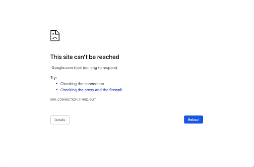

No way! Can't have that! So since companies need to make sure their users can always access their services, and they're willing to pay for that feature, ISPs can charge them a bit more and provide them with static IP addresses, which are IP addresses that won't ever change.

This is fine, but what about the rest of us? I want to be able to remote into my home PC without having to worry about my IP changing randomly!

This is where something called Dynamic DNS comes into play. Dynamic DNS is essentially software running on your computer which reaches out to some web service, such as ipify.org, and asks "Hey what is my IP address?" The web service then responds with the IP address of the computer that the request originated from. Once the software receives the response, it then maps that IP to a domain name whenever it changes!

Woah! This solves our problem entirely!

Many sites will allow you to do this for free, including Dyn, and Noip to name a couple. And if you're not too picky about the domain name you're assigning to your IP, these services take care of everything for you.

However, you'll need to renew these services every 30 days to keep your free domain name.

And your choices of the domain name will be limited to the few domains they have available.

So as long as you're fine with renewing mydomain.freedynamicdns.net every month you'll be all set!

Awesome right?!

Actually no, on second thought, that kind of sucks. Their free tier seems pretty annoying to keep up to date, and who in the world wants to go to mydomain.freedynamicdns.net?

No one, that's who. Let's take a look at their paid options.

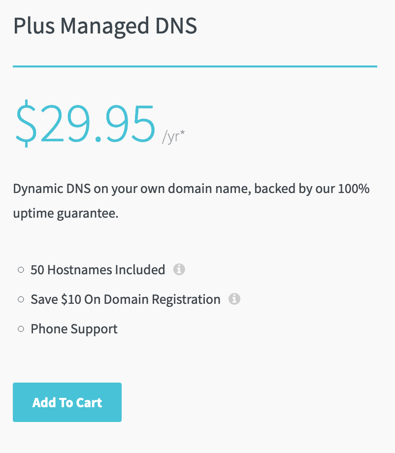

What? $30 a year?! Most domain names are less than half that AND we'd still have to buy our domain!

All their software is doing is checking your IP address and updating a DNS record with a domain name registrar. We can do this ourselves with very little effort and be up and running in no time.

## Building A Dynamic DNS App

Let's get to it. We’re going to be building our app in Ruby for its ease of use and readability, however, this can be done with whichever server-side language you’d prefer.

### Getting Our External IP

First, we'll need some way to check our external IP address. We could find a way to programmatically communicate with our router to see what IP address is assigned to its outward-facing interface, but this would take way too long to set up as well as be very different depending on what kind of router you have.  
A much simpler solution would be to get our external IP by sending an HTTP GET request to one of the dozens of services that exist for this specific reason. We’ll be using ipify.org. Ipify will look at the source IP of our HTTP request, and return that IP to us as a string! All we’ll need to do is save that response to a variable.

```
require 'rest-client'
 
ip = RestClient.get('https://api.ipify.org')
 
puts ip
```

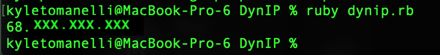

IP address has been censored

Awesome! We're halfway there!

### Updating DNS Records With Cloudflare

Next, we'll need to connect to our domain name registrar and update our DNS record and tell it that we need it to point to this IP

I have a domain which has nameservers pointed over to Cloudflare, so let's see if we can use their API to update the DNS record for this domain.

And looks like there's a Ruby gem wrapper for the Cloudflare API, so we'll just add the following line to our Gemfile:

gem 'cloudflare', '~> 4.2'

And we'll require it in our main file:

require 'cloudflare'

Great! Now we'll need to make sure we have proper keys to access the API. To get those, we'll head over to Cloudflare, sign in, and go to our profile page.

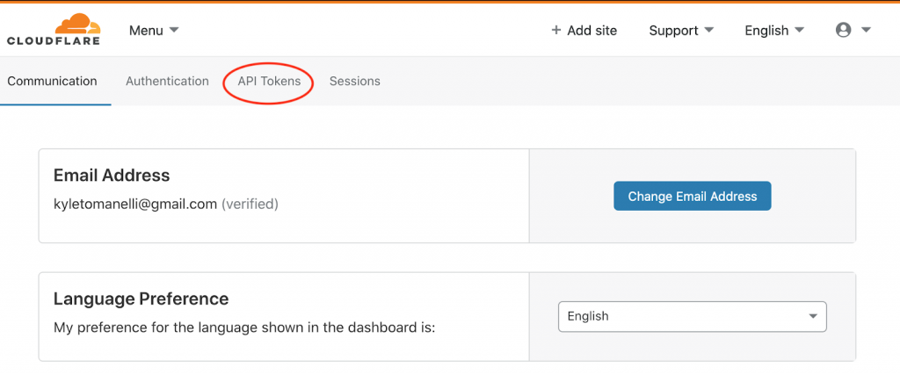

From there we'll click on the 'API Tokens' tab and click 'Create Token'.

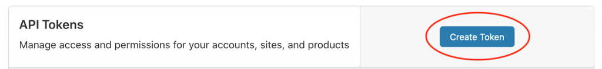

Select the template for 'Edit zone DNS'

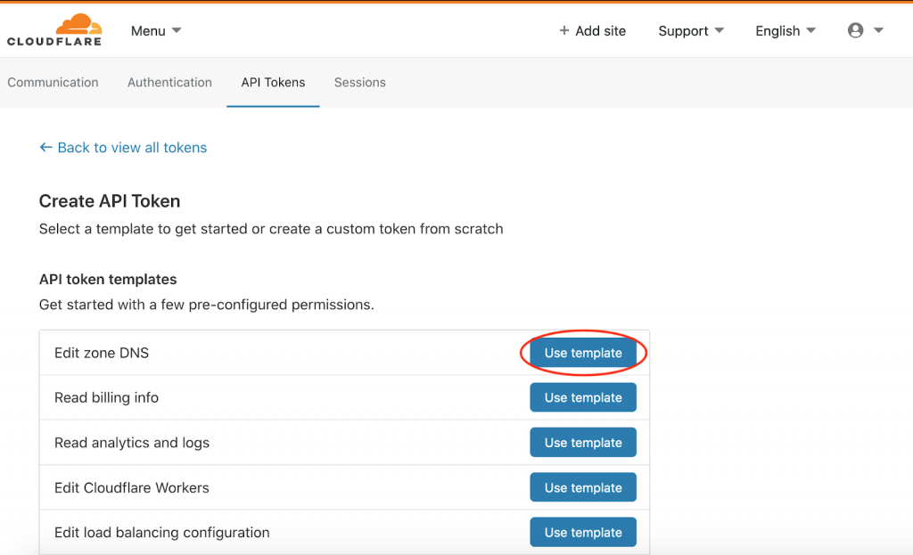

From here, we'll have to configure the permissions our token will have. We'll need access to Read our Zones, as well as access to Edit DNS records for those zones once we have them. So your token should look something like this:

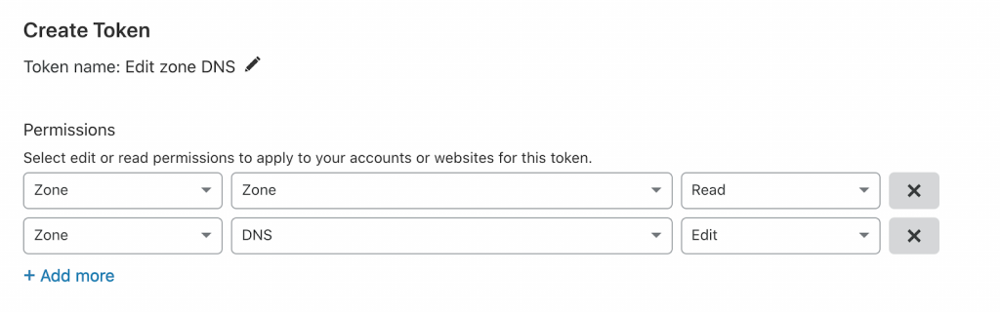

Once you've set the correct permissions, we'll need to set which resource(s) we want this token to have access to. We can allow it to access all our zones, which would let us change settings on all the sites we have on Cloudflare, or we can choose a specific zone that we want to change the information on.

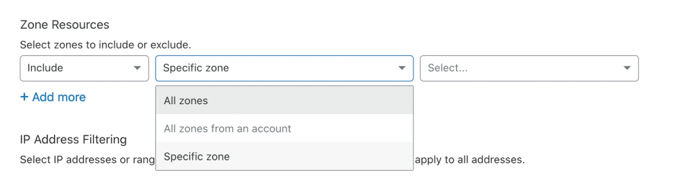

Usually, it's better to limit access as much as possible but we'll need to allow access to all our zones so we can search through and find the one we want. So we'll allow access to 'All zones from an account' and select our account. Once we have the id of the zone we want, we can save it in our .env file and go back to update our token permissions.

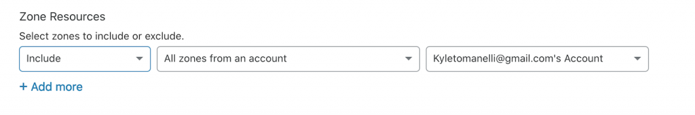

Scroll down to the bottom of the page and click 'Continue to Summary' and this is what our summary should look like:

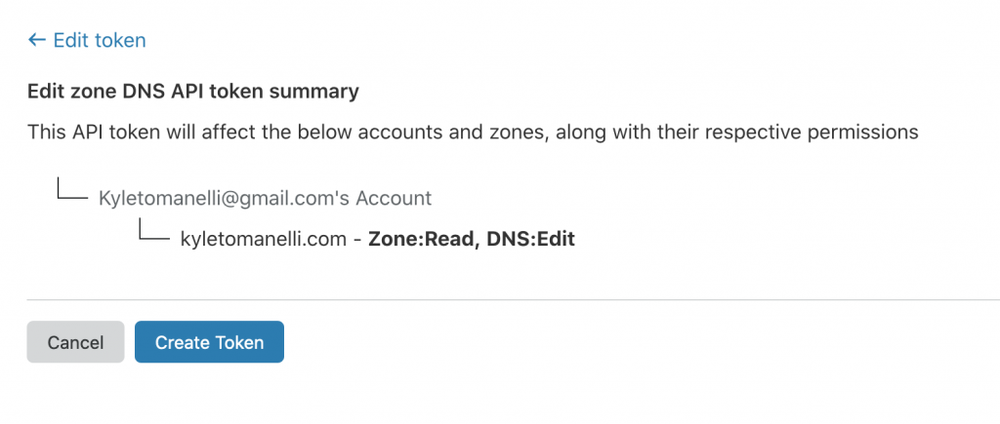

Once you're happy with your token's permissions, click Create Token.

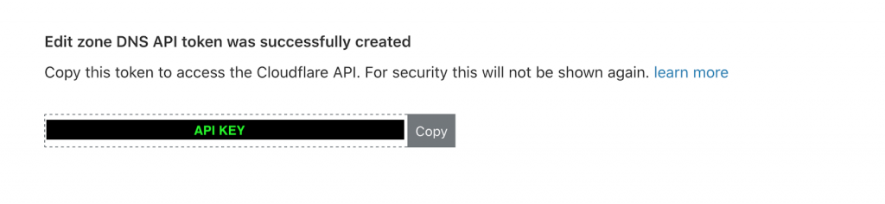

And here it is! Let's copy and paste this token into our .env file\* so we can start making changes!

\*A .env file is a file that, along with an external library(dotenv), will emulate local environment variables on your computer. We need this in order to make our code easier to test and develop, make it more usable for others, as well protect our api keys. Instead of keeping our api key visible in our code, we’ll put it in our .env file, which we’ll add to our .gitignore file, so our environment variables stay safely on our computer when we push our commits. Then if someone wants to use our code, all they’ll need to do is either set environment variables on their computer, or make a .env file and put their variables there!

So now that we have our Cloudflare token, let's figure out how to use it to access our data!  
According to the [documentation](https://github.com/socketry/cloudflare/blob/master/README.md), we can initiate a connection to the API with the following code:

```
token = ENV['CLOUDFLARE_TOKEN']    

Cloudflare.connect(token: token) do |connection|
    
end
```

We can search for our resource by using: 

connection.zones.find\_by\_name(“resource-name-here”)

Since I already have some DNS records listed for my resource, let's see if we can get them to display to confirm we have everything working.

```
token = ENV['CLOUDFLARE_TOKEN']

ip = RestClient.get('https://api.ipify.org')

Cloudflare.connect(token: token) do |connection|
  zone = connection.zones.find_by_name("kyletomanelli.com")
        
  zone.dns_records.each do |record|
    puts record
  end
end
```

Let's break down this code.

1. We're initializing our connection to Cloudflare with our token.
2. Then we're calling zones.find\_by\_name("kyletomanelli.com") on that connection variable and setting it equal to zone. This is essentially searching all the zones we have on our account and finding the one that matches our parameter.
3. Once we have that we're calling .dns\_records on it to get a list of all the records associated with that zone and we're iterating through that array and printing out each record.

Let's see what this prints!

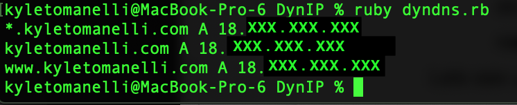

Perfect! These are my current records!

Let's try to add one now!

As per the documentation, we can create new records by calling .create() on zone.dns\_records and passing the following parameters **(record-type, name of record, IP, proxied: true/false)**

So lets put together our parameter list to create our record.

1. We'll use an A record for the first parameter which is an Address type. ([check this wiki article if you wanna know more about DNS record types!](https://en.wikipedia.org/wiki/List_of_DNS_record_types))
2. The name of the record is going to be what our URL will be. So if I want to connect to my home PC at rdp.kyletomanelli.com, my record name will have to be 'RDP'.
3. Our IP is easy! We already grabbed that from ipify earlier, so we'll just pass that along!
4. Proxied will be set to false as we're not going to worry about adding a proxy in this scenario.

So our code to add our record will look something like this:

```
require 'rest-client'
require 'cloudflare'
require 'dotenv/load'

token = ENV['CLOUDFLARE_TOKEN']

ip = RestClient.get('https://api.ipify.org')

Cloudflare.connect(token: token) do |connection|
  zone = connection.zones.find_by_name("kyletomanelli.com")
    
  zone.dns_records.create('A', 'rdp', ip, proxied: false)

  zone.dns_records.each do |record|
    puts record
  end
end
```

Let's run this and see if our record is added!

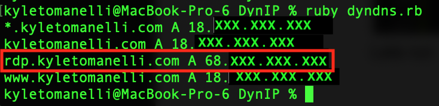

Perfect! Rdp.kyletomanelli.com now points to my home IP address!

We can confirm everything is working by trying to ping rdp.kyletomanelli.com

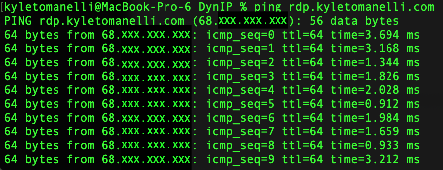

And there we go! We're getting ICMP responses from our home router by pinging the new record we just put in!

Now that we're able to check our external IP, and update our DNS record, let’s clean up our code and add some logic to check for when the IP changes!

```
require 'rest-client'
require 'cloudflare'
require 'dotenv/load'

token = ENV['CLOUDFLARE_TOKEN']

ip = RestClient.get('https://api.ipify.org')

Cloudflare.connect(token: token) do |connection|
  zone = connection.zones.find_by_name("kyletomanelli.com")
  record = zone.dns_records.find_by_name("rdp.kyletomanelli.com")

  if record.content != ip
    record.delete
    zone.dns_records.create('A', 'rdp', ip, proxied: false)
  end 
end
```

Now we're checking if the Content stored in our DNS record, which is the IP, is the same as our current external IP, and if they're different, we're deleting the old record and creating a new one with the new IP address.

The only thing we have to do now is throw a loop around this method and set a timer for how frequently we want our app to check for IP changes!

### Rinse and Repeat!

```
require 'rest-client'
require 'cloudflare'
require 'dotenv/load'

token = ENV['CLOUDFLARE_TOKEN']

loop do
  ip = RestClient.get('https://api.ipify.org')
    
  Cloudflare.connect(token: token) do |connection|
    zone = connection.zones.find_by_name("kyletomanelli.com")
    record = zone.dns_records.find_by_name("rdp.kyletomanelli.com")
    
    if record.content != ip
      record.delete
      zone.dns_records.create('A', 'rdp', ip, proxied: false)
    end 
  end
  sleep(1800)
end
```

Amazing! We're done! Now every 30 minutes, our program will check to see if our external IP address has changed and if so, it'll update our DNS record so we can still access our home PC!

We can also change the delay time simply by adjusting the sleep value.

We just built an app that companies are charging users $30 a year to use, in a matter of a few minutes! All we're doing here is checking our IP address and comparing it to our DNS record, if they're the same, we do nothing, but if they're different, we update our record

Imagine what other services you use could be easily recreated to save you extra money!

This app we built can be used for much more than just remoting into your PC. You can use it for any sort of hosting! Whether you're setting up a public website or if you're hosting a Minecraft server! This will allow users to be able to access the content you want to share, by only having your domain name and the port your service is using!

[Click here to view this app on Github!](https://github.com/ktomanelli/DynamicDNS)
