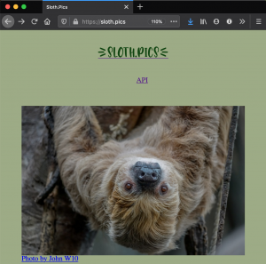
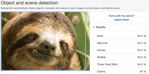
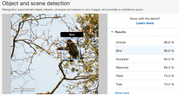
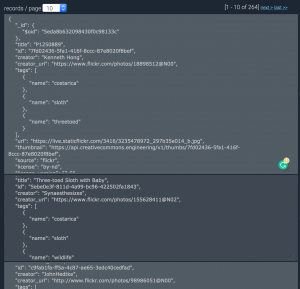

_Photo by [iamrandygirl](https://www.flickr.com/photos/70284362@N00)_

So a few weeks ago I was searching the internet for some sort of API endpoint that could programmatically provide me with pictures of sloths.

I knew I didn't just want to Google image search because there are always other things that show up beside your search query.

See? Case in point, this page had a few bears and I exclusively want sloths!

It didn't take me long to realize that the tool I'm looking for just doesn't exist.

And that kind of makes sense, right? I mean what kind of person would put spend their free time trying to scrape sloth images off the internet, pass those images along to some sort of image recognition service, like AWS Rekognition, collect all the labels they provide, sort through them to confirm that the word 'sloth' shows up with at least a 75% confidence rating, and discard the other images. They'd then have to save this data, along with the meta-data of the images, into a database and write an HTTP server function to randomly query the database and return the image URL of the random image.

. . . . . . . .

_Photo in screenshot by [John Wenzelburger](https://www.flickr.com/photos/87857615@N02)_

So that's exactly what I did.

> [https://sloth.pics](https://sloth.pics)

# The Build

The API was built with Node.js. Mainly because I was on a bit of a time crunch since I knew I wanted to use AWS Rekognition, I didn't want to have to waste time figuring out how to get AWS working in any other server-side language. If I had more time, I probably would have opted to build the backend with Ruby and Sinatra or Rails.

## Collection

The first part of this sloth pipeline is the initial collection process. I used the [Creative Commons API](https://api.creativecommons.engineering/v1/) to collect images that showed up under the search query 'sloth'. I store each image URL along with its meta-data into an object and then save each object into an array so I can iterate through them later.

Once I had the image URLs, I wanted to be able to forward them to AWS Rekognition, which is an image recognition service that accepts an image and detects (to the best of its ability) what exactly is in the picture!

## Rekognition

They have a neat demo here: (you need an AWS account to use demo) [https://console.aws.amazon.com/rekognition/home?region=us-east-1#/label-detection](https://console.aws.amazon.com/rekognition/home?region=us-east-1#/label-detection)

Here's an example of this image recognition in action!

_Photo in screenshot by [Michelle Callahan](https://www.flickr.com/photos/60654399@N00)_

As you can see, Rekognition is 94.5% sure that this is in fact a sloth!

Great!

Except sometimes it's not so sure...

_Photo in screenshot by [Steven Lam](https://www.flickr.com/photos/39647236@N07)_

Unfortunately, there's not much I can do about these cases, but the vast majority are still also are labeled 'sloth' at a relatively high percentage. So not really a problem as long as I make sure my sloth acceptance percentage low enough to catch the outliers.

So on to actually sending over my images to Rekognition. I used the NPM package '[aws-sdk](https://www.npmjs.com/package/aws-sdk)', which is the wrapper for AWS services for node. And just a side note, AWS has some amazing services. You can come up with dozens of new project ideas, just from scrolling through the services they offer!

The tough part is actually getting their tools set up and working!

I've tried to use AWS services in the past so I knew using them again was going to be incredibly difficult, they have pages and pages of documentation which walk through initial set up of the dozens of services they offer but the documentation is so dense that it really gave me a hard time, so if for some reason you get an error, have fun searching and searching for the answer to your problem.

Knowing this, I wanted to limit how many AWS services I used. I exclusively wanted to use Rekognition if possible. Their demo above allows you to pass in image URLs, so I assumed their SDK tool would also allow it.

Wrong.

The Rekognition SDK service can only accept images from an AWS S3 bucket or in the form of a base64 encoded string. So since I'm limiting how many AWS services I'm using, I went for the base64 route. Which meant I needed to download and encode each image I was getting from google. For this, I found '[node-base64-image](https://www.npmjs.com/package/node-base64-image)', which is an NPM package that does exactly that, download and encode/decode images into/from base64.

So after a couple of hours of trying and failing to analyze a particular image(the size of which happen to be over 5MB), I get past all the authentication, and region errors, and come across an error which leads me to this AWS faq page for Rekognition:

Shit.

What a waste of time! The images I pulled from Google are all different sizes, many smaller than 5MB, but a decent number of them were bigger. I didn't want to have to limit the image size to under 5MB so that really only left me with 1 other option.

## S3

Reluctantly, I opened up the AWS S3 documentation and got to work. I NPM installed another package called '[image-downloader](https://www.npmjs.com/package/image-downloader)' because I no longer needed to encode anything myself, and the previous package I was using didn't seem to be capable of downloading without encoding.

I was able to download the images from google, upload them to the root of an S3 bucket, give them a unique name based off the date/time of upload, and then pass to Rekognition without any major problems. Setting up S3 was way less painful than I was imagining it to be. I think once you get started with AWS it's easier to keep the momentum going with their other services. That initial set up though really is the worst when you're new to it.

So now that I'm actually getting Rekognition labels, I add a check for the word 'sloth' and confidence of at least 75% and if the image is a match, I use S3's copyObject function to copy the image into a 'confirmedsloths' folder and delete the original image from the bucket root.

## MLab

Once I've got a confirmed sloth, I save the name of the S3 image, along with the labels returned by Rekognition, to that initial sloth object that was I was using to store the image URL, width, and height.

I then send this object to an MLab database to hold until we get an API request.

MLab is a document-oriented cloud database platform owned by MongoDB. Document-oriented databases are non-relational databases. And instead of storing tables, that relate to each other, they're used for storing documents, which are pretty much just JSON objects. MLab is really easy to set up and is perfect for prototyping projects especially since it's free as long as you're under 0.5GB of storage. And since we're just storing JSON objects, we'll have plenty of space for our data.

And since MLab is owned by MongoDB, I was able to use Mongo's [NPM wrapper](https://www.npmjs.com/package/mongodb) to access, store, and retrieve my data.

## The API

I used Express to set up the frontend and API side of this project. I have a GET route set for '/api', which calls on MongoDB's \$sample method to pull a random document from the database. This allows for the fetch call on the root page of the site that displays a random sloth image on page load. This also allows for everyone to be able to pull random sloth images from the database whenever they want with just a GET request.

## Heroku

When looking into how exactly this app would be hosted, I came across a few options. I was already in deep with AWS but the thought of setting up and EC2 instance or a Lamda made me feel nauseous. So I decided to go with Heroku and I think it was a really great call. I've never used Heroku before but I'm absolutely going to use them again. Getting my app set up and running on Heroku was one of the easiest parts of this whole process. I literally ran 3 commands, from my terminal and my app was accessible from the web. Absolutely incredible. I'm sure Heroku set up would be more complex if my little app had more meat on it but either way, my experience was surprisingly painless.

## Things to Improve

As the API stands now, It'll work great for the project I originally needed it for, however, there are a few things I'd love to improve in the future.

1.) I'd love to add more images. This should be easy, I just need to look into the g-i-s docs and see how to get the next 100 results and then run my collector functions.

2.) On top of wanting to get more photos, I feel like I'd prefer if I didn't get any duplicates, so maybe I can find some sort of image comparison tool to implement and if the new image is particularly similar to an image already in the database, I'll just drop that image and move on to the next one.

3.) I'd love to implement some sort of size matching capability to the API and allow requesters to specify the size of an image they want and return them a sloth image of that size.

This was a really fun project to work on and although a random sloth generator doesn't seem particularly useful to anyone, the tech behind it very much is. Image recognition is and will continue to be a massive part of our lives and I'm really glad I took the time to learn a bit more about how this tech works.

If you'd like to take a look at the code behind Sloth.Pics, [here's a link to the repo!](https://github.com/ktomanelli/Sloth.pics)
