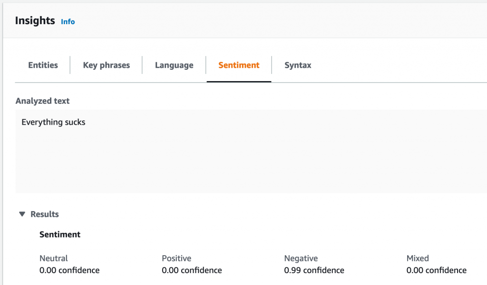
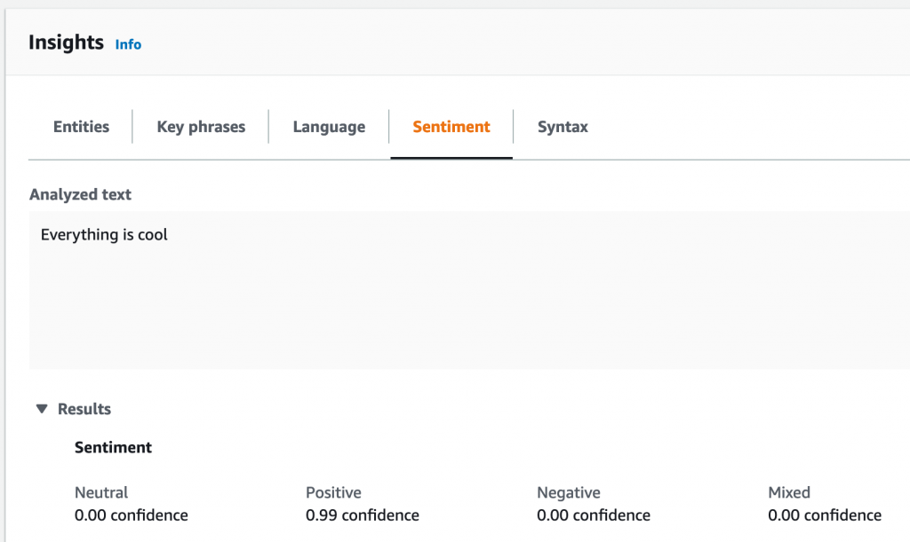
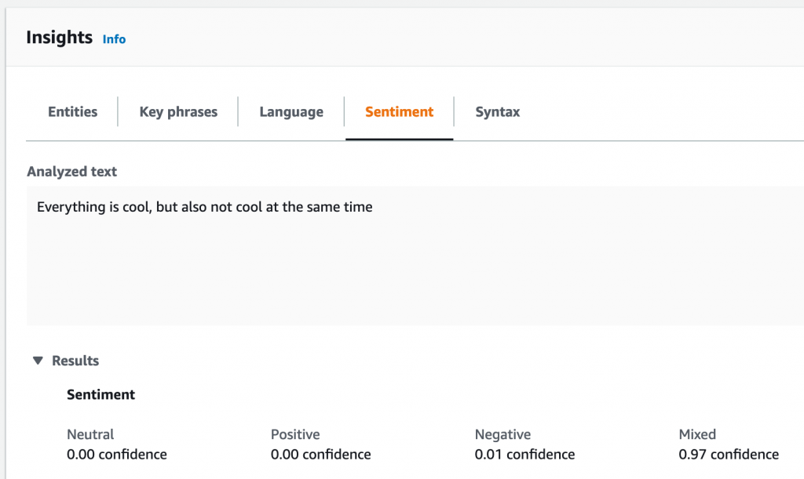

I love Twitter. I think it's the best social media platform by far. Its user base is so funny, political, technical, and diverse that you can get thousands and thousands of different points of view on any given topic. Anyone can make an account, say exactly what they think about a particular subject and the masses can either agree, disagree, or just completely ignore what they have to say. And with all these different people sharing their thoughts, views, resources, and first-hand news, you get a truly unique experience on the web. The downside of course is with ease of access to the platform, there come some truly vitriolic and hateful views.  
One of my favorite qualities about Twitter's user base, however, is that for the most part, the community will speak out against hate and injustice many times louder than the users who are spewing their hate.

All these differing views of the user base makes Twitter itself a phenomenal tool to gauge public opinion on any given topic. Just check the trending page to see what people are talking about today and you can get a decent idea of how the masses feel about politics, celebrities, media, or current events in general. However Twitter falls a bit short when trying to view overall sentiment and how the trends relate to each other. And becuase of this I decided to build a tool to make this data a bit easier to see, and enable people to use twitter to get a more concrete approximation of public opinion.

## The Build

I'm once again building this tool with Node.js because of it's wealth of great documentation, and because it's just what I'm most comfortable with. This project however could have been built in any server-side language.

### Twitter API

So the first place to start here was getting access to Twitter's API in order to search for and analyze tweets. This process was mildly annoying as in order to get access to the API you need to fill out a form describing what exactly your app will be used for and a number of fields have a minimum character limit, so if your app has a relatively simple concept you'll need to fluff up your description to meet that limit.  
Once I got the app approved and received the API keys, setting up the Twitter side of this project actually turned out to be really easy. You can get a batch of 100 tweets (which is the max number of tweets you can get per request on their free API tier), by just running 1 function. I'm using the [Twitter NPM package](https://www.npmjs.com/package/twitter) to connect to Twitter's API

```
const getTweets = (input = {}) => {
  const options = {
    ...input,
    tweet_mode: 'extended',
  };

  return new Promise((resolve, reject) => {
    client.get('search/tweets.json', options, (err, tweets, response) => {
      if (err) reject(err);
      resolve(tweets);
    });
  });
};
```

So what I'm doing here is really just accepting the input object which will contain a search query, the count of how many tweets I want, and a tweet ID of where I want to start my search from. I'll get into why this last parameter is necessary a bit later. But then I'm just returning a promise which will resolve when we get a return from Twitter's .get method. This is what actually retrieves the tweets we want to work with.

### Sentiment Analysis

Once I had the tweets I wanted to work with, I needed to pass them along to something called a sentiment analyzer. This is a tool that can parse text and return basic data on what the text is about, as well as more complex data pertaining to the possible sentiment the person who composed the text holds for the topic they were writing about. This is usually performed by some sort of AI/machine learning service which is capable of deep analysis of each word and how it fits together with the rest of the text. For instance, if someone is writing about a topic that frustrates them, they are more likely to allow that frustration to come across in what they're writing. The sentiment analysis picks up on the word choices and ques and makes a calculation to determine the sentiment behind the statement.

I ended up using AWS Comprehend for my sentiment analysis because I've used their other services in the past and knew how to get up and running relatively easily.

### AWS Comprehend

As stated above, AWS Comprehend is a sentiment analysis service that can take in some text and return the sentiment. They have a neat [demo](https://console.aws.amazon.com/comprehend/v2/home?region=us-east-1#home) that displays what you can do with the service on their site. (You need an AWS account to use demo).

As an example of what this project will be doing, let's go through their demo and input some simple strings to get the sentiment!



As you can see in the image, I input the string 'Everything sucks' into the text field and Comprehend was able to parse, analyze, and determine that this statement has a mainly negative sentiment.  
Lets change the word 'sucks' to the words 'is cool' and see what Comprehend thinks!



And we get the exact opposite! Comprehend is now able to determine this statement, 'Everything is cool', has mainly a positive sentiment! Lets change things up one more time and see if Comprehend can keep up.



And now with the statement 'Everything is cool, but also not cool at the same time', Comprehend can determine our contradiction and returns a mainly mixed sentiment.

This is what we're going to be on a larger scale. We're going to be passing the tweets we searched for over to Comprehend to get the sentiment data for each one, and average the data together to get sentiment for the entire batch of tweets! This will give us a rough approximation of the public's opinion of whatever we search for.

Setting up Comprehend also turned out to be relatively simple. Once again, only one function that takes in a params object which contains the tweet text as well as the language of the text, which I have set to English as default, and then returns a promise which resolves when the detectSentiment function returns with the sentiment data

```
const comprehend = new AWS.Comprehend();

const detectSentiment = params =>
  new Promise((resolve, reject) => {
    comprehend.detectSentiment(params, (err, data) => {
      if (err) reject(err);
      resolve(data);
    });
  });
```

Now all I had to do was put the pieces together, and build out a function to handle the averaging of the sentiment values.

### Putting the Pieces Together

So to start out I made a function called getBatch() which takes in a query string, a tweet ID which I have set to null by default, and a tweet count, which I've set to 100 by default. This function starts by calling the getTweets function from earlier. Then, once the promise resolves it iterates through the returned array and calls detectSentiment on the text of each item in the array. Once the sentiment data gets returned, the data gets saved along with the tweet object to an array that gets returned at the end of the function. You can view the code for this function below.

```
const getBatch = async (q, since_id = null, count = 100) => {
  let tweets;
  const tweetObjects = [];

  try {
    tweets = await getTweets({ q, count, since_id });
  } catch (err) {
    console.log({ err, message: 'twitter error' });
  }
  for (let tweet of tweets.statuses) {
    if (tweet.retweeted_status) {
      tweet = tweet.retweeted_status;
    }

    let data;
    try {
      data = await detectSentiment({
        LanguageCode: 'en',
        Text: tweet.full_text,
      });
    } catch (err) {
      console.log({ err, message: 'aws error' });
    }

    tweetObjects.push({
      tweet,
      score: data.SentimentScore,
    });
  }
  return tweetObjects;
};
```

Once I had the sentiment data for each tweet, I needed a function that would iterate through each object and collect an average for each sentiment value. I made the following function to handle this task.

```
const getAverages = (tweetObjects, avg = null) => {
  let averages;
  let length;
  if (avg) {
    length = avg.length + tweetObjects.length;
    averages = {
      POS: avg.newAverages.POS * avg.length,
      NEG: avg.newAverages.NEG * avg.length,
      NEU: avg.newAverages.NEU * avg.length,
      MIX: avg.newAverages.MIX * avg.length,
    };
  } else {
    length = tweetObjects.length;
    averages = { POS: 0, NEG: 0, NEU: 0, MIX: 0 };
  }

  const totals = tweetObjects.reduce(
    (acc, { score }) => ({
      POS: score.Positive + acc.POS,
      NEG: score.Negative + acc.NEG,
      NEU: score.Neutral + acc.NEU,
      MIX: score.Mixed + acc.MIX,
    }),
    { POS: 0, NEG: 0, NEU: 0, MIX: 0 }
  );

  const newAverages = {
    POS: (totals.POS + averages.POS) / length,
    NEG: (totals.NEG + averages.NEG) / length,
    NEU: (totals.NEU + averages.NEU) / length,
    MIX: (totals.MIX + averages.MIX) / length,
  };
  return { newAverages, length };
};
```

This function starts by checking if a previous avg object was passed in, and if so, multiplies each average sentiment value by the total length of the avg object so we can continue adding values to the total and update the cumulative averages.

This is necessary because of Twitter's 100 tweets per request limit. This limits forces us to work in 100 tweet increments. Getting average sentiment data for each batch and then adding data from the next batch to the values that were previously computed.

If the avg object is not present, the length is just set to the length of the current batch, and all the sentiment totals are set to 0. Then we pass the new batch of tweets and sentiment data along to a reduce function which handles adding each sentiment value to a respective cumulative total.

From here, I just had to add the new totals to the past sentiment totals (if they were passed in), and then divide by the length of the total array. This provides us with the averaged sentiment data for whatever we were searching for.

I wrote one last function to handle putting everything together and you can view that function below:

```
const startSentimentCollection = async q => {
  let batch = await getBatch(q);
  let last = batch[batch.length - 1].id;
  let avg = getAverages(batch);
  console.log(avg);
  setInterval(async () => {
    batch = await getBatch(q, last);
    last = batch[batch.length - 1].id;
    avg = getAverages(batch, avg);
    console.log(avg);
  }, 5000);
};
```

As you can see, this function takes in our 'q' which is our search query, gets the first batch of tweets, sets the last tweet's id to the variable 'last', collects the averages, and console.logs the results. After that we have a setInterval which handles the repetition of getting each next batch of tweets/sentiment data, and adding their averages to the cumulative total.  
\*sidenote, the setInterval is running every 5 seconds to avoid Twitter's rate limiting.

### The Data

Now that the app is functioning and able to do what we wanted, let's take a look at the data we can get from it!

I decided to start with a search query that I figured would yield more of a negative sentiment so I went with the word 'Trump' and after letting the program run for a few minutes, and collecting 20,000 tweets, it returned the following data.

```
{
  newAverages: {
    POS: 0.07864765810124544,
    NEG: 0.3978361151887306,
    NEU: 0.5187170662118326,
    MIX: 0.004799163817373066
  },
  length: 20000
}
```

So this data is pretty much what I was expecting. From the few terms I've passed to the program, the NEU value always seems to be relatively high compared to the other values and the interesting difference comes from the POS and NEG values. And as you can see the NEG value is over 30% higher than the POS value.

A lot of information could be extrapolated from this data, but the main take away is that it's very likely that most of the users who tweeted about Trump while I was collecting tweets hold more negative sentiment toward Trump than positive.

Let's try another term that's more likely to have a negative result. I'll go with 'police'.

```
{
  newAverages: {
    POS: 0.07066945583137597,
    NEG: 0.4661934192377025,
    NEU: 0.4582778751182974,
    MIX: 0.0048592463739560365
  },
  length: 20000
}
```

The NEG value is actually the highest for this search, and the POS value is very similar to the previous POS value. Which means the higher NEG value must have come from the NEU. And we can see that the NEU value is indeed lower than the previous search.

Let's try another one. I want to see if we can get a term that would show more of a positive sentiment now. Everyone loves Beyoncé. Lets try her name.

```
{
  newAverages: {
    POS: 0.23080466096930977,
    NEG: 0.07702994230921113,
    NEU: 0.6654915713110547,
    MIX: 0.026673816435813284
  },
  length: 20000
}
```

Okay and as predicted, the POS value is higher than the NEG value, but both are much lower than the NEU value.

Here's another for 'ice cream'. Not as positive as I was expecting.

```
{
  newAverages: {
    POS: 0.24085833624000583,
    NEG: 0.14815865337459377,
    NEU: 0.6072242310789998,
    MIX: 0.0037587841247454933
  },
  length: 20000
}
```

Here's another for 'amazon'. I was honestly expecting this one to skew more negative.

```
{
  newAverages: {
    POS: 0.1575233591149704,
    NEG: 0.10215063048984045,
    NEU: 0.7316414848392913,
    MIX: 0.008684525660005098
  },
  length: 20000
}
```

And just for fun, here's one for 'doggo'.

```
{
  newAverages: {
    POS: 0.2901776734304807,
    NEG: 0.27294818314021707,
    NEU: 0.43363969265483504,
    MIX: 0.003234447956347707
  },
  length: 20068
}
```

### What Can Be Done With This Data?

Well, not much right now. The data by itself in these singular searches is pretty meaningless but I believe if given more tweets over a larger period of time, this data could be used to make some very interesting comparisons and some neat data visualizations.

In addition to the general sentiment data, I belive the time frame of these tweets could also yield interesting data. For instance, 20,000 tweets about a particular topic made in an hour is very significant difference when compared to 20,000 tweets about a topic made in a day.

### What Can Be Improved?

I have a few ideas for where to go from here. I'd love to be able to host this tool online and allow people to use it but the way the Twitter API is set up currently that's just not possible. I'm running one search and I need to space my requests out every 5 seconds to avoid being rate limited, so pretty much anyone else trying to use this tool at the same time would break it entirely. A way around this might be to have users sign in with their Twitter and perform the searches with their accounts.

On top of allowing others to use the tool to gather data, I would love to use it myself and figure out a neat way to visualize the data I'm collecting. This could yield some interesting insights.

Either way, this was a really fun project to work on and I look forward to continuing to build out this tool! If you'd like to view the Github repo, or clone it down and use it yourself, you can do so [here](https://github.com/ktomanelli/Twitter-Sentiment-Analysis).
