Github Pages is a phenomenal way to get your project up and running for free. And if you don't need a fancy domain to go along with your project then you'll be fine with a URL like this:

https://githubusername.github.io/repo name/

But if you'd rather have your own domain so you don't have to give out this long URL, you can add it with relative ease!

For the sake of this blog, I'm assuming you already have a site hosted and live on GitHub Pages, and you already have a domain you'd like to use. If you need help initially setting up your site on GH Pages, check out this [blog](https://medium.com/swlh/deploy-github-pages-in-minutes-32d1b22b5c93).

## GitHub

So to get started, let's head over to our repo! I'm going to be using a repo for a Tetris game I worked on for my Flatiron School Mod 3 project which is currently hosted at [https://ktomanelli.github.io/flatiron-tetris/](https://ktomanelli.github.io/flatiron-tetris/).

Now, from our repo, we want to click settings.

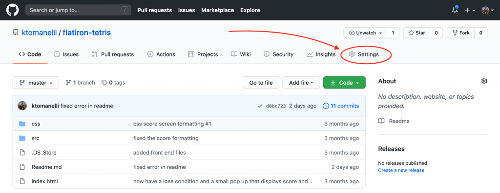

And then scroll down to the Github Pages section.

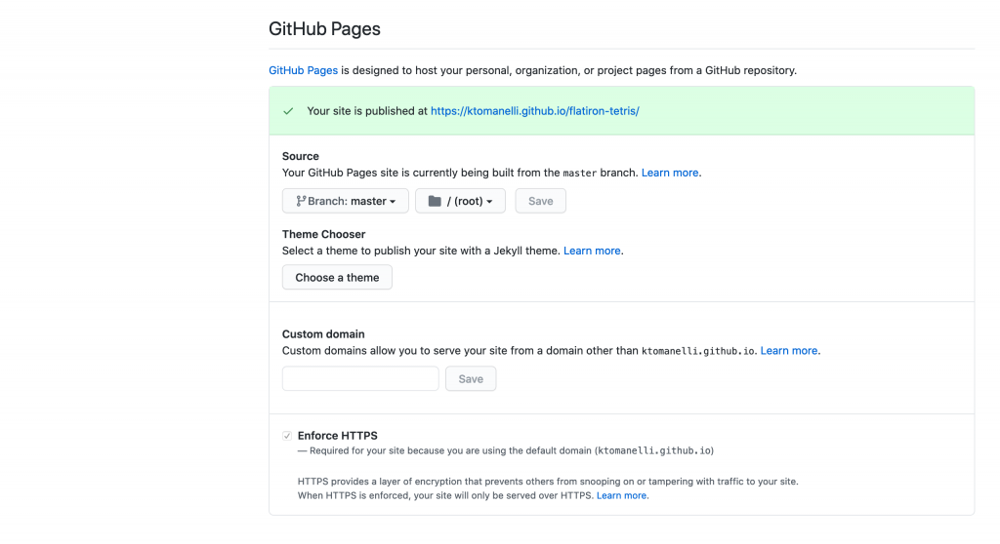

You should see a similar green bar at the top of this section indicating that your site is published at a github.io URL. If you don't see this then your repo is not hosted on GitHub Pages, and you'll need to configure that before continuing.

Now we'll need to put our domain in the custom domain text box and click save. This will be the URL people use to access your site.  

I found the domain Tetris.website for $2 on Namecheap, so I'll go ahead and type that in and click save.

Once you do this, the page should refresh and you'll see this message at the top of your window:

You'll also notice a new file in your repo! The file is called CNAME and only contains the domain you just added. This file is what allows GitHub Pages to route between multiple projects hosted on your account. I'll explain more about this in a bit, but for now, just make sure you keep that CNAME file in the root of your repo!

Now let's take a look at our website to see where we're at!

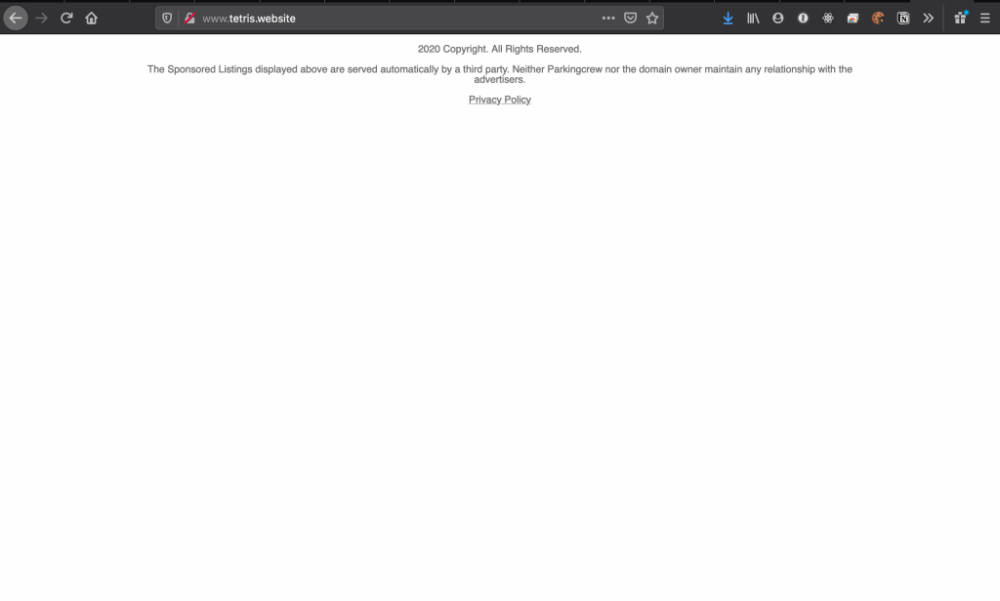

Empty! This is what's to be expected at this point. We haven't made any changes to our DNS records to point to GitHub so we're only seeing a parked page!

## DNS

This section is where our paths may have to diverge a bit, as the steps to change DNS records will be different for each registrar. However every registrar should follow the same standard of actually composing and adding the DNS records so once you figure out _how_ to add records on your platform, you should be good to keep following!

As I said earlier, I got my domain off Namecheap, so that's where I'll set my DNS records.

To do so, I'll head over to Namecheap, sign in, and go to my dashboard where all my purchased domains are listed. I'll then click 'Manage' on the domain I want to add records to.

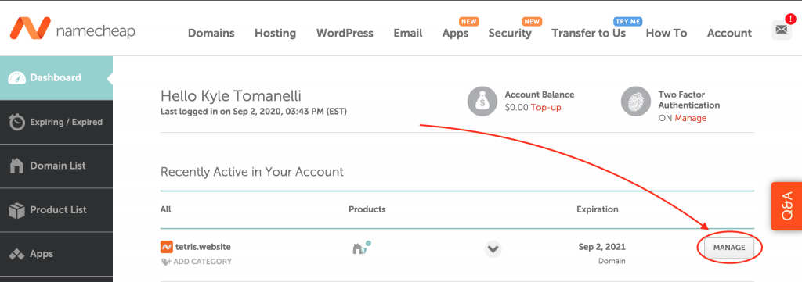

From here, I'll need to click 'Advanced DNS'

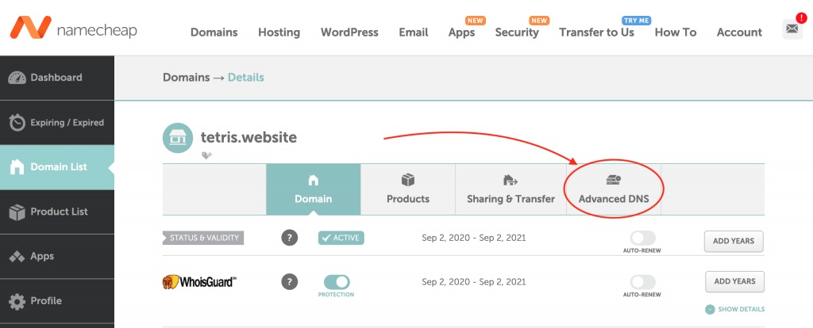

This will bring us to the page where we can add DNS records. Now because I just purchased this domain, there are a couple of records already there by default which point to the Namecheap parked page URL. We can delete these as they won't be needed.

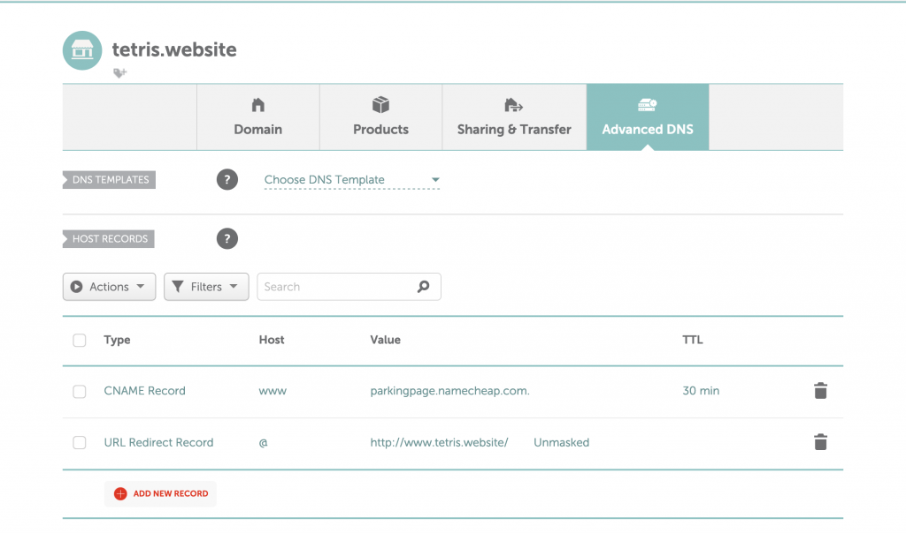

Now let's add a new record, by clicking the 'Add New Record' button at the bottom.

This will bring up a form with the fields Type, Host, Value, and TTL. We're only going to have to change Type, Host, and Value for the records we're setting. TTL can remain the default value on each new record.

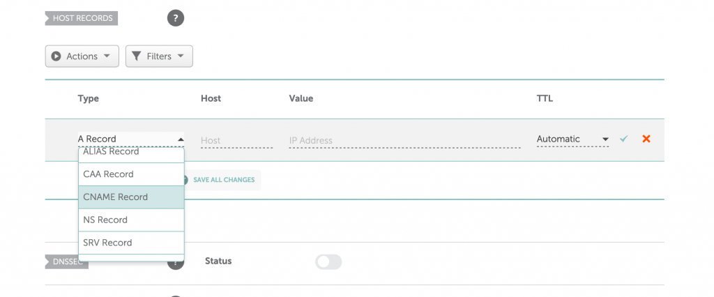

For the first record, lets change the type value to CNAME as seen above. We'll then set Host to 'www' and value to:

'<your github username>.github.io'

Here's an example of how it should look:

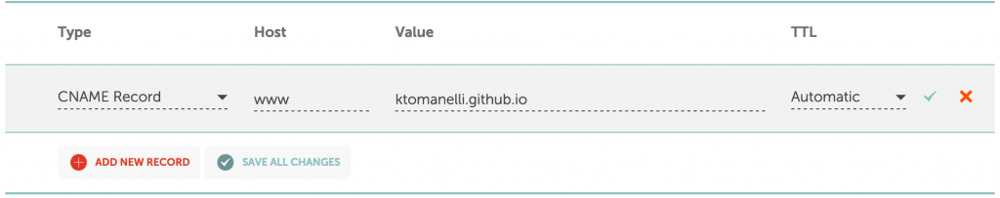

Obviously your CNAME record should have your github username and not mine.

Once your record is correct, go ahead and click 'Save All Changes'.

Okay so CNAME should sound familiar at this point as that's the name of the file that was automatically added to our repo. It was added because GitHub Pages needs some way to know which of our projects we're trying to access. Since we're only ever pointing our CNAME record to our base username.github.io, there needs to be another way to figure out which repo we need to go to, and that's where the CNAME file comes into play.

When we try to access our GitHub Pages site via a custom domain, GitHub's server receives the request, and sees our username at the front of the URL, from there it checks which of our repos are hosting sites, and which of _those_ repos has a CNAME file that matches the domain of the request, and then serves that repo's site.

Now we'll have to add 4 more records before we're completely finished, and these will all be A records, rather than CNAME records, which will point to GitHub's servers. So to start let's click 'Add New Record' and select 'A Record' for Type, '@' for Host, and the IP address '185.199.108.153' for Value and click 'Save All Changes' again. Your records should look like this:

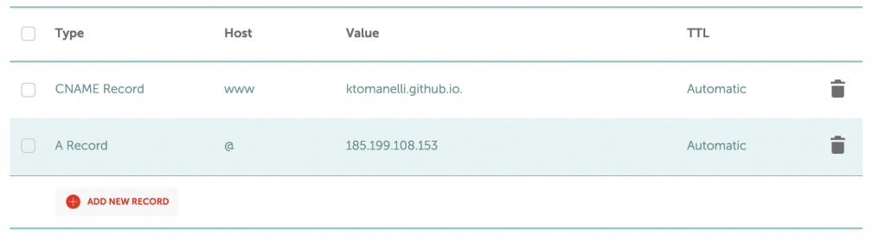

At this point, your site should be accessible via your custom domain but we don't want to stop just yet. Just to confirm, we should be able to go to Tetris.website and see the Tetris game from my old project.

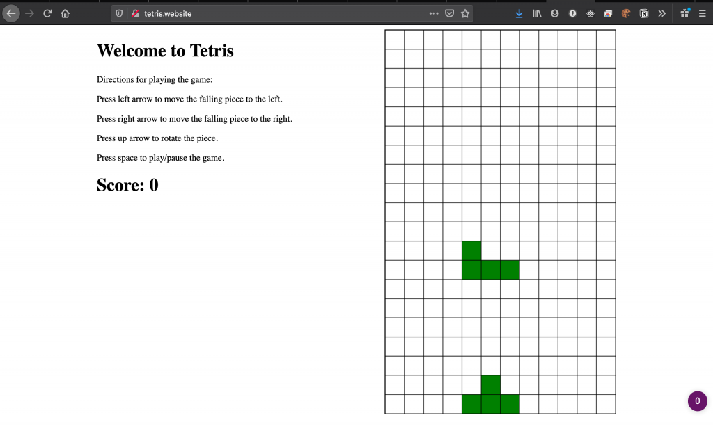

We'll still want to add the next 3 A records in case the server our first A record is pointing to ever goes down.

So let's add 3 more A records with the same format as the last except with the following IP addresses substituted in:

185.199.109.153

185.199.110.153

185.199.111.153

Our DNS records should now look like this:

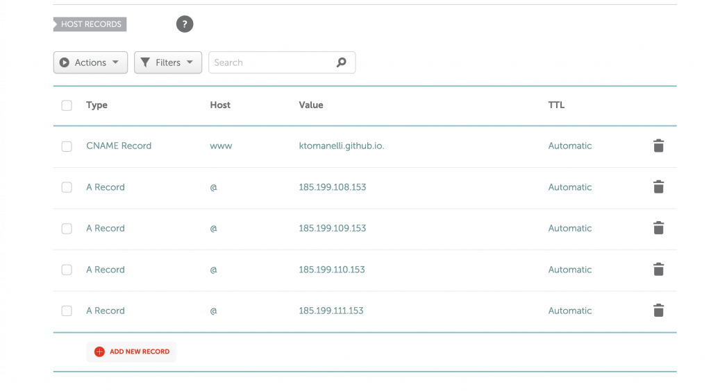

Adding these extra A records will allow for Round Robin DNS which helps with load balancing as well as making sure your site stays up if the initial route goes down. You can learn more about Round Robin DNS at this [link](https://en.wikipedia.org/wiki/Round-robin_DNS).

Your site should now be accessible via your custom domain name, as well as protected if any of the 4 GitHub Pages IP addresses go down.
