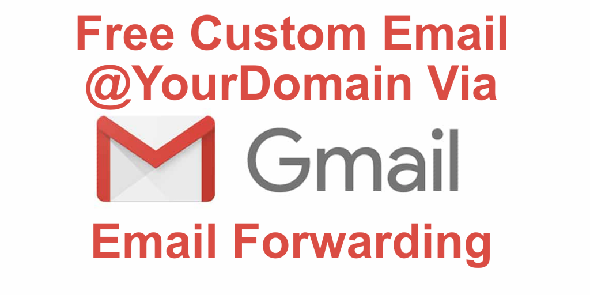

So you picked up a new domain for your side project and you've got your website up and running, but now you need a way for people to get in contact with you! Sure you can use your personal email but having people reach out to your Gmail account doesn't quite lend the same professionalism as having an email @ your custom domain.

This blog will show you exactly how to set that up.

## Email Hosting Options

I've been working on a site called [Shape Studio](https://shape.studio), which is an in browser 3D Modeling application. And when the site goes live, I'd like to give users of this application the option to contact me if any bugs or issues come up, but I don't want to just give out my personal email. This led me to looking into the ways of hosting email for my domain, and I found a few options.

#### G Suite

G Suite is probably the best option for those who have the budget for it. For me however, this is definitely not the option.

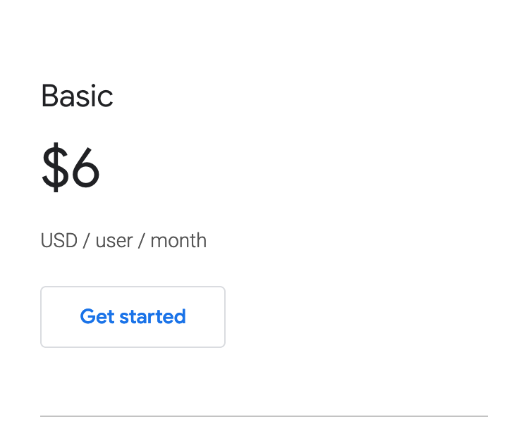

A basic G suite account (which is their cheapest tier), will cost $6 per user per month. Since it's just me working on this project, it would really just be $6/month but since the project won't be making any money for the foreseeable future I think I'll go another route.

#### Zoho

Another option I found is Zoho. They seem to be a cheaper version of G Suite. A very similar platform, with web apps for docs/excel/slides, included in their Workplace plan. Their Mail Lite monthly plan however is a bit cheaper per user. At $1 a month, you might not even notice it for a team of 1. You'd just have to keep an eye on your mail storage as you'd be limited to 5GB.

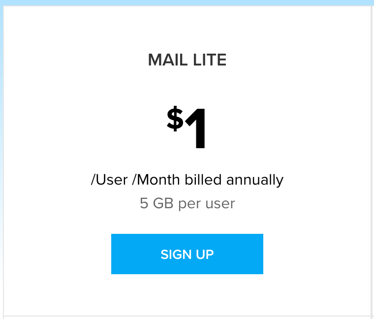

Even though Zoho is cheaper, I'd still rather spend no money if possible. This let me to email forwarding.

#### Email Forwarding

Email forwarding is kind of like your custom email piggybacking off of your personal email. People will still be able to send emails to your new address and those emails will just be sent right over to whatever email account you want them to send to. You'll also be able to reply to those emails or send new emails from the new address with a bit of set-up and I'll show you how that's done in a bit!

My domain is set up on Google Domains so that's where I'll have to go to set up my email forwarding. Obviously you'll have to set this up where ever your domain was registered.

So first, I'll head to my domain page on Google Domains and select the 'Email' option from the side bar on the right.

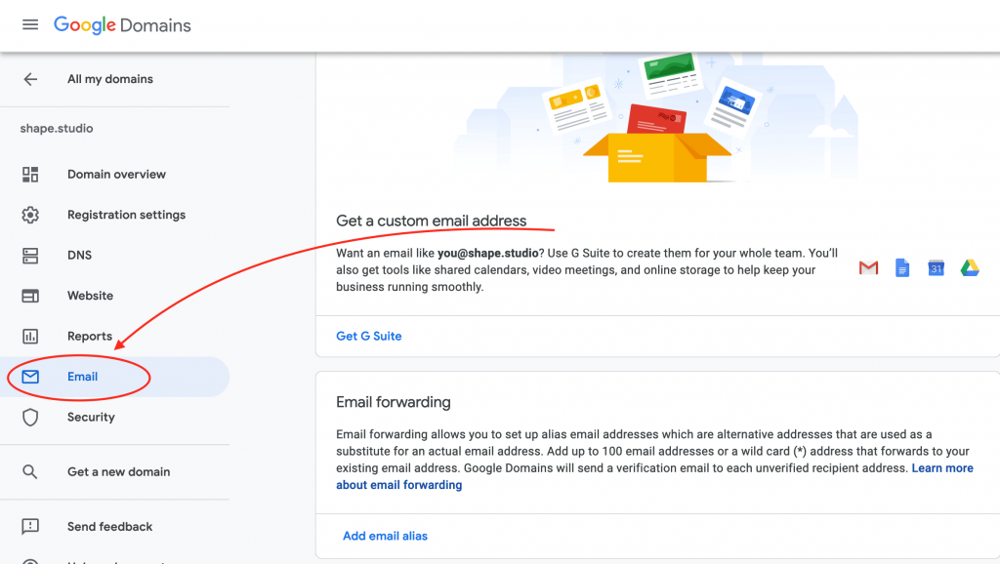

Then I'll scroll down to the 'Email Forwarding' section and click 'Add email alias'.

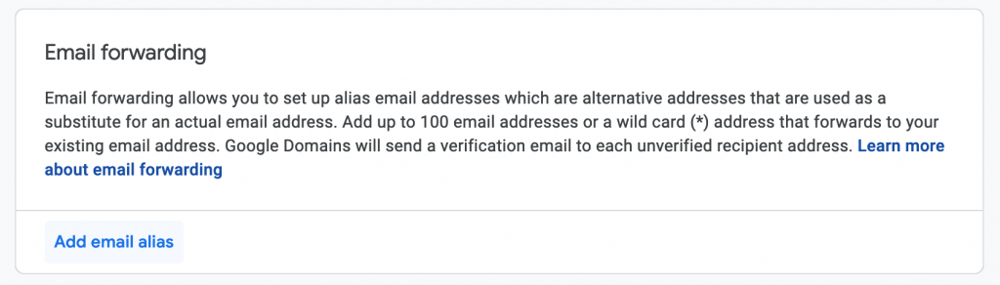

A small form will appear with text boxes for 'Alias email', and 'Existing recipient email'. Alias email will be whatever you want to be before the @ sign in your new email, so I'll put my name, Kyle. The existing recipient email, as you can probably guess is the email we'll be forwarding to so I'll put my Gmail address.

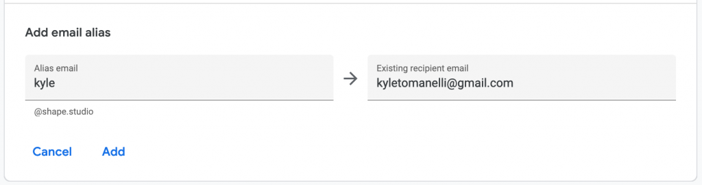

Once you're happy with your email settings, go ahead and click 'Add'. You'll see your new email and an indication that it's now forwarding to your old email.

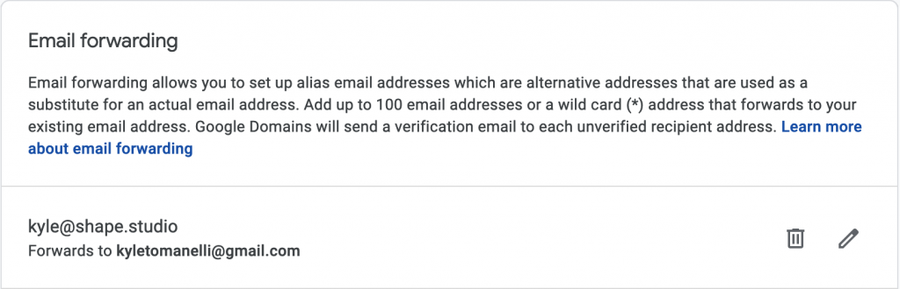

You can confirm this is working by sending a test email to your new email and checking if it shows up in your inbox.

#### Sending From a Forwarded Address

Now if the email you're forwarding to is a Gmail account, you can follow these steps to be able to actually send from your new email.

First, you'll have to create an app password for the new alias email account to have access to your Gmail. To do so you can go to [https://myaccount.google.com](https://myaccount.google.com), and click 'Security' on the left sidebar.

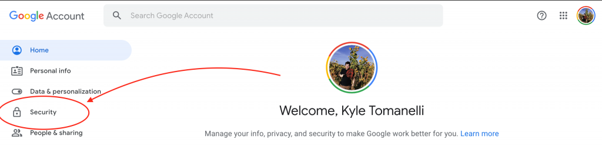

From Here, scroll down to the 'Signing in to Google' section and click App passwords.

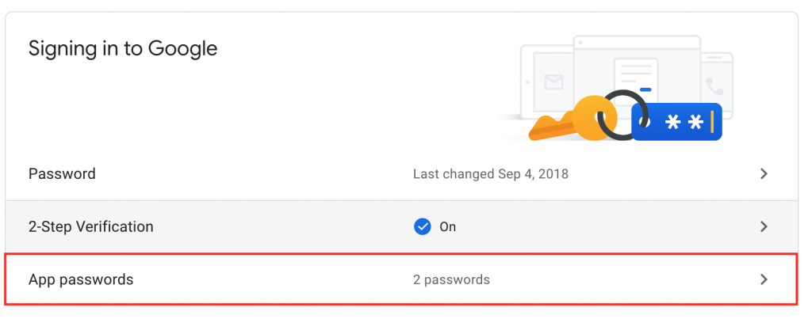

From here, select 'Other' from the 'Select App' drop-down menu.

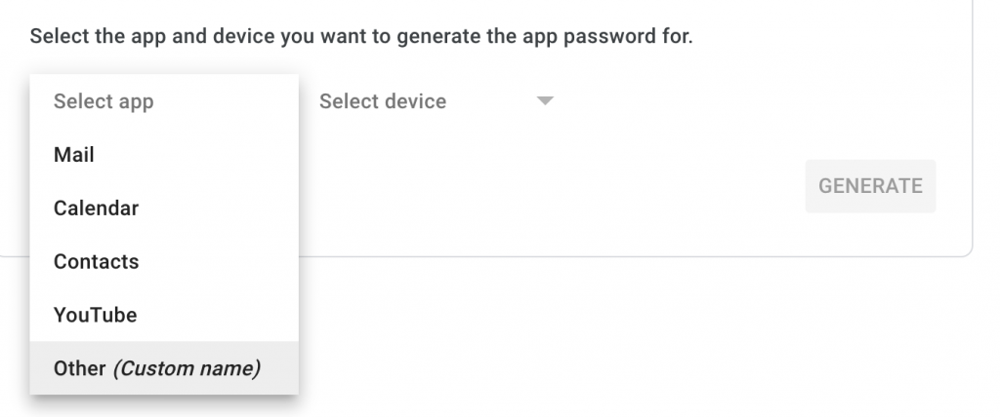

And put a label for your account password in the text field that appears, and click 'Generate'.

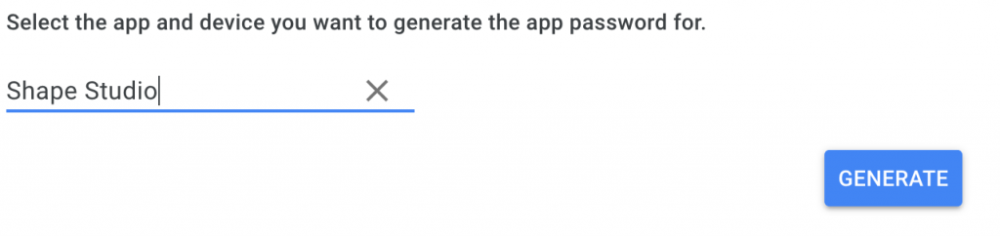

You'll then be presented with your app password (I've censored mine for obvious reasons).

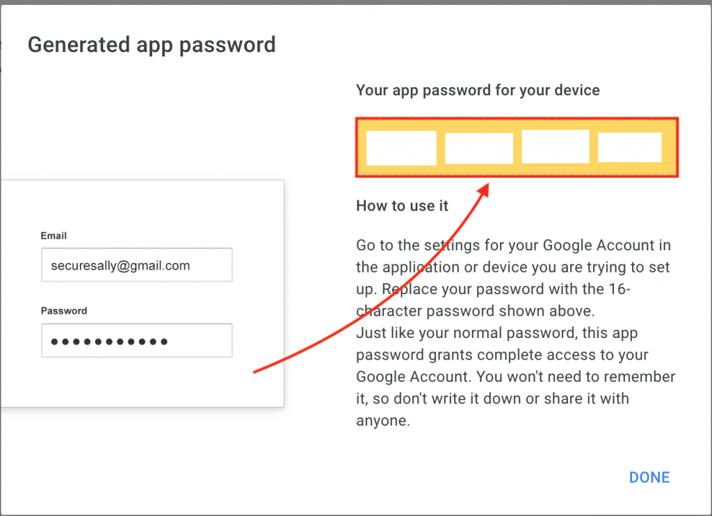

Make sure to save this password for the next step!

Now, in another tab, let's go to Gmail, and click the gear in the top right corner, then click 'See all settings'.

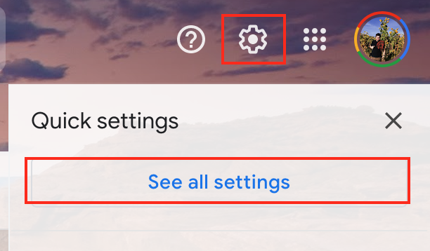

Then go to the 'Accounts and Imports' tab.

Scroll down to the 'Send Mail As' section, and click 'Add another email address'

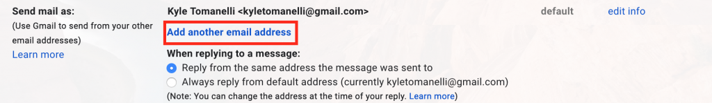

In the page that opens, input your name and the new email in the form inputs. Don't worry about the 'Treat as an alias' checkbox as it won't affect our new email as we're forwarding to our old Gmail rather than adding another email account to our Gmail.

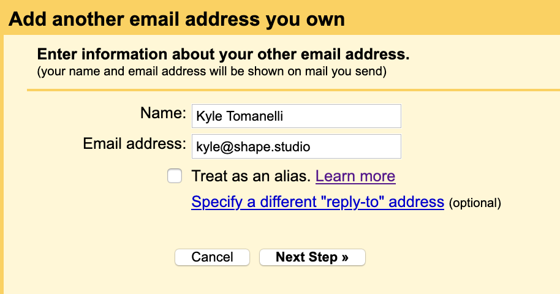

Once you're done, click Next Step.

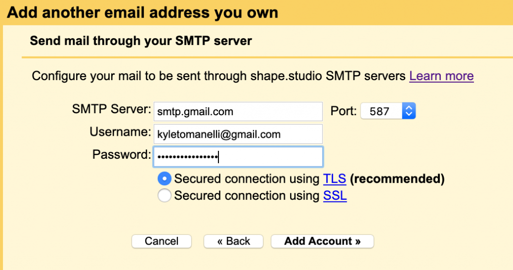

Input 'smtp.gmail.com' into the SMTP Server field, leave port as 587, input your gmail account as the Username field, and that App Password we saved from earlier in the Password field. Click Add Account when your info is correct.

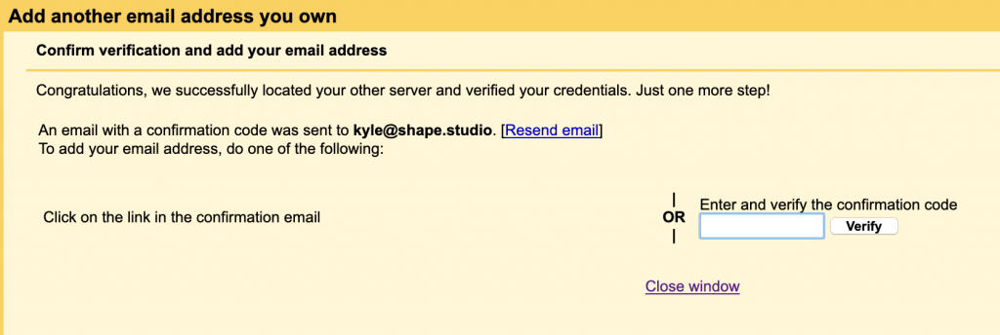

We're almost there! Now just check your email and click the confirmation link, and click confirm, or input the confirmation code from the email on this page and click Verify!

Now you're all set! You should now be able to receive emails to your new email address, and after a few minutes of Google's system working its magic, you should also be able to send emails from your new address by clicking your email address in the email compose window and selecting your new email!

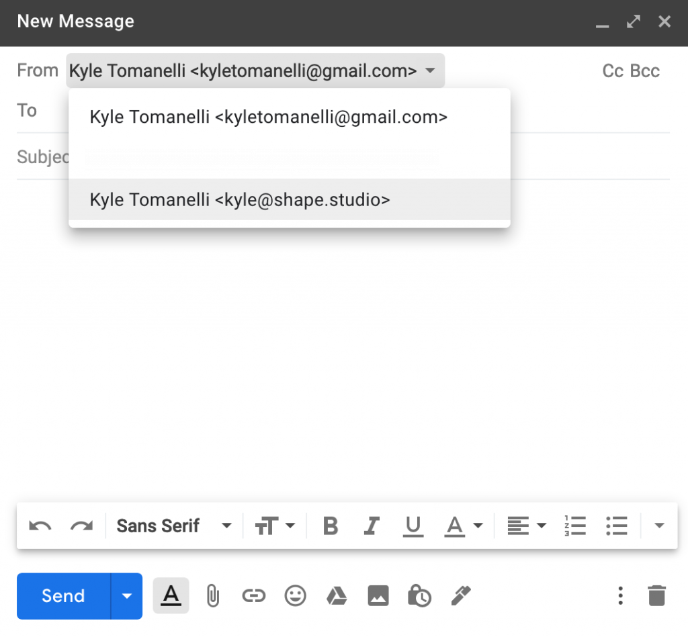

Enjoy using your new email address for $0 a month per user!
