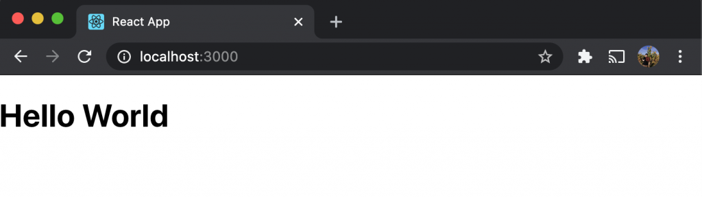
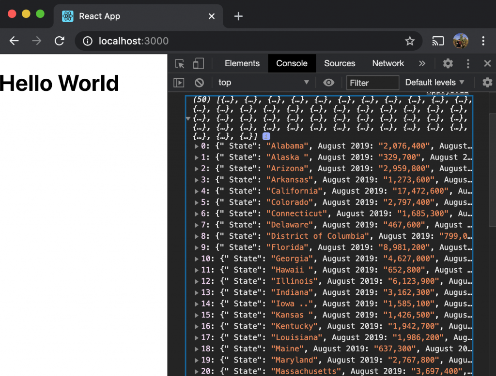
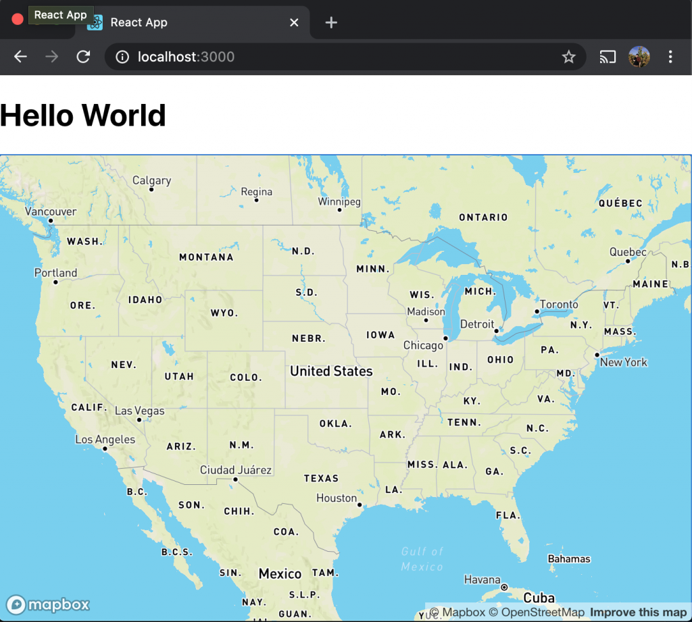
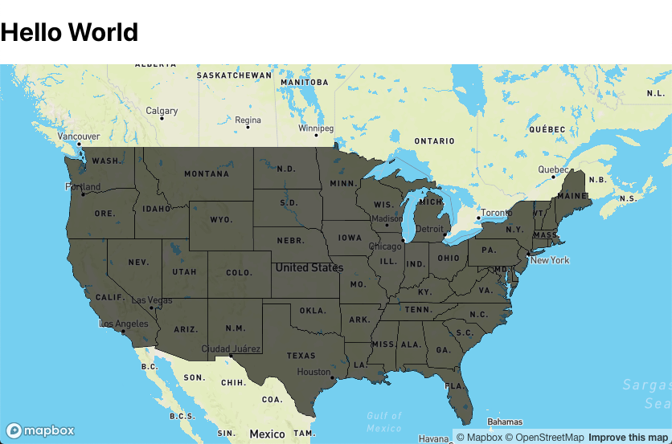
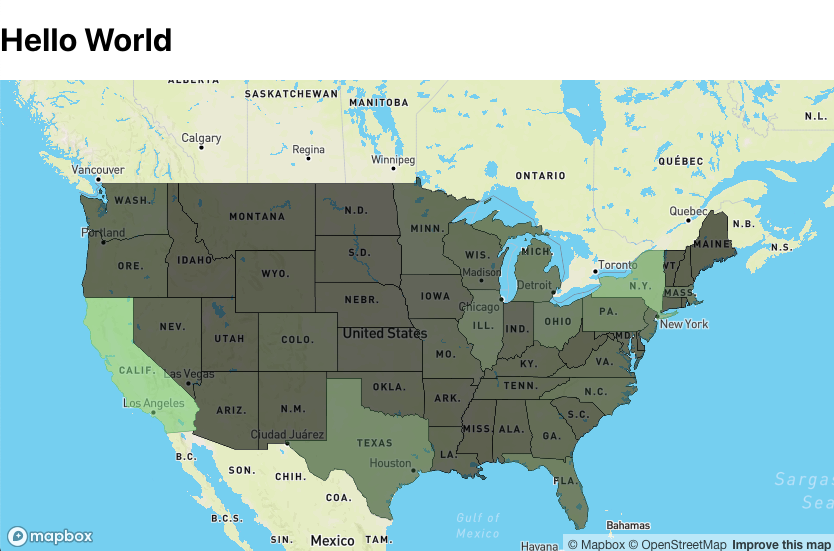

When thinking about a problem, it's imperative that you have the correct data to work with. Luckily here in 2020, we have seemingly endless access to research data on pretty much everything, and it's just a quick Google search away. But sometimes just having access to some data isn't quite enough. There are somethings that you just can't get from a .csv file.

And that's where being able to visualize the relevant data comes in handy. There can be aspects of the data you're not seeing, trends that you wouldn't be able to distinguish when the data was just numbers in a spreadsheet. Whereas adding that visual element can make those trends much clearer.

In this blog post and the next, I'll go over how you can get started making map-based data visualizations using a JavaScript map tool called Mapbox GL. Mapbox is a mapping platform for custom designed maps, and we can use its flexibility in map design to add a geographic dimension to the data we're working with!

## Our Data

So the first step in making a map-based data visualization is having some data you'd like to add a geographic component to. Now before we begin it's good to think about if geography really is the best way to visualize your data. For instance, if we wanted to visualize some data about the _number_ of unemployment claims over the last month from a particular county, a geographic visualization may be of some help here to give us some general insight on which towns were hit hardest by recent lay-offs. However if we wanted to instead visualize data on _when_ in the last month these lay-offs took place, a geographic visualization may not be the best medium. For this demo, I'll be using the Department of Labor's [State Employment and Unemployment Summary for August 2020](https://www.bls.gov/news.release/laus.nr0.htm). I'll grab the data, paste it to a .csv file and place the file in the project directory that we'll make in the next step.

## Setting Up Our Project

So to get started I went ahead and made a create-react-app called 'unemployment-vis'. I then moved my .csv file from earlier into the 'public' folder of my 'unemployment-vis directory. I then npm installed 'mapbox-gl' which is the mapbox library, and a package called 'papaparse' which we'll be using to parse our .csv.

$ create-react-app covid-vis ... $ npm install mapbox-gl ... \$ npm install papaparse

Now let's clear out App.js in the 'src' folder and convert it to a functional component. We'll also add a constant called pathToCsv which we'll set to "process.env.PUBLIC_URL+'/employment-by-state.csv'". This will point to the location of our .csv file in the 'public' folder.

```
import React from 'react';
const pathToCsv=process.env.PUBLIC_URL+'/employment-by-state.csv'

const App = ()=>{

  return(
    <h1>Hello World</h1>
  )
}

export default App;
```

Then run 'npm start' to confirm we have everything set up correctly.



And looks like we're good so far.

## Parsing Our Data

Now let's set up papaparse so we can get our .csv data into a format we can actually work with. We'll need to use a useEffect hook to parse our data once the component mounts, and also useState to store our parsed data and pass it along to our map component later. So lets add useEffect, and useState to our React import as well as add an import for papaparse.

```
import React, {useEffect, useState} from 'react';
import Papa from 'papaparse'
```

And then add a state variable for our parsed data and a useEffect to our App component.

```
const App = ()=>{

  const [data,setData] = useState(null)
  useEffect(()=>{

  },[])

  return(
    <h1>Hello World</h1>
  )
}
```

Great, now anything we put inside our useEffect hook will be run when our component mounts! So let's actually put something in there.

We'll call papaparse's .parse function, to which we'll pass our pathToCsv, as well as an object containing the following key-value pairs.

- {header : true} - Allows .csv headers to be parsed to make an array of JSON objects rather than an array of arrays.
- {download : true} - Allows us to actually use the data in the 'complete' function.
- {skipEmptyLines : true} - As you could probably guess, this key tells the function to skip a line in the .csv if that line doesn't hold any data.
- {complete : (result) => { console.log(result.data) }} - Holds a function that will run on the data returned once the file has been parsed. For now we're just logging the data to the console.

Your useEffect should look like this:

```
  useEffect(()=>{
    Papa.parse(pathToCsv,{
      header: true,
      download: true,
      skipEmptyLines: true,
      complete: (result)=>console.log(result.data)
    })
  },[])
```

Okay let's save and check if we're getting our data in the console.



Yes! That's our data, now lets update our 'complete' function so instead of logging to the console, it saves that data to our data state variable.

```
//App.js

const [data,setData] = useState(null)
  useEffect(()=>{
    Papa.parse(pathToCsv,{
      header:true,
      download: true,
      skipEmptyLines: true,
      complete: (result)=>setData(result.data)
    })
  },[])
```

## Mapbox

So for this next part we'll need to grab a couple more pieces before we can continue. Specifically, we'll need a Mapbox API key, and a geojson file for our geographical boundaries.

For this demo we'll need the boundaries for each US state. I was able to find a geojson file for the US state boundaries [here](https://github.com/PublicaMundi/MappingAPI/blob/master/data/geojson/us-states.json). So I'll download that file and throw it in to our src folder.

As for the API key, you'll need to make a Mapbox account. You can do so [here](https://account.mapbox.com/auth/signup/). Once your account is created, you can get your API key from [here](https://account.mapbox.com/).

## Getting a Map to Display

Once you have your geojson file as well as your API key, we'll make a new file in our 'src' folder called 'Mapbox.js'. In this file we'll start by importing react, along with the useState, useEffect, and useRef hooks. We'll also import mapboxgl, the states json file, and a mapbox style guide.

```
import React, {useState,useEffect,useRef} from 'react'
import mapboxgl from 'mapbox-gl'
import states from './us-states.json'

import "mapbox-gl/dist/mapbox-gl.css";
```

Then we'll make a variable called 'styles' which will hold some styling for the map component.

```
const styles = {
    width: "100vw",
    height: "calc(100vh - 80px)",
    position: "absolute"
  };
```

Now we'll make the actual Mapbox component. We'll need to make a ref and call it mapContainer, and a state var called map. And we'll return a div with a ref set to {el=>mapContainer.current=el}. Make sure to export the function!

```
const MapboxGLMap = (props) => {
    const mapContainer = useRef(null)
    const [map, setMap] = useState(null);

    return(
        <div ref={el=>mapContainer.current=el} style={styles} />
    )
}

export default Map
```

Next we're going to need another useEffect, inside we'll set our mapbox.accesstoken to our Mapbox API key(I'm using a .env file to store my API key, you can do the same by npm installing dotenv and requiring it), then define a function that will initialize our map and we'll pass in our mapContainer ref as well as our setMap.

```
    useEffect(()=>{
        mapboxgl.accessToken = process.env.REACT_APP_MAPBOX_ACCESS_TOKEN
        const initializeMap=({setMap,mapContainer})=>{

        }
    })
```

Then within our initializeMap function we'll define our mapbox map and pass in a container, which will be our mapContainer.current, a map style, which I got from mapbox(you can look through pre-made styles or make your own!), center coordinates which land our map right over the U.S., and a zoom value which is determines how zoomed in the map will be.

```
            const map = new mapboxgl.Map(
                {
                    container: mapContainer.current,
                    style: 'mapbox://styles/mapbox/streets-v11',
                    center: [-95, 40.72],
                    zoom: 3
                }
            )
```

Then under our initializeMap definition, we'll check if the map has been set in state and if it hasn't we'll call initializeMap. So far our useEffect should look like this:

```
    useEffect(()=>{
        mapboxgl.accessToken = process.env.REACT_APP_MAPBOX_ACCESS_TOKEN
        const initializeMap=({setMap, mapContainer})=>{
            const map = new mapboxgl.Map(
                {
                    container: mapContainer.current,
                    style: 'mapbox://styles/mapbox/streets-v11',
                    center: [-95, 40.72],
                    zoom: 3
                }
            )
        }
        if(!map) initializeMap({setMap, mapContainer})
    }, [map])
```

So now lets jump back over to App.js and import our Mapbox component and throw it under our Hello World. We'll also want to add a check for our data and only mount our map if we have completed our data parse. I'll do this by adding a ternary statement. Also don't forget to pass in the data variable as a prop!

```
//App.js

import React, {useEffect} from 'react';
import Papa from 'papaparse'
import Mapbox from './Mapbox'
const pathToCsv=process.env.PUBLIC_URL+'/employment-by-state.csv'

const App = ()=>{

  useEffect(()=>{
    Papa.parse(pathToCsv,{
      header:true,
      download: true,
      skipEmptyLines: true,
      complete: (result)=>console.log(result.data)
    })
  },[])

  return(
    <>
    <h1>Hello World</h1>
    <data?<Mapbox data={data}/>:''}
    </>
  )
}

export default App;
```

And at this point our map should be showing up on the page!



We're almost there! All we need to do now is add our geojson data to our map and add styling to each section according to our data!

## Setting Map Boundaries

So now that we've got our map displaying on the page, lets add our geojson data as an overlay. To do so we'll add map.source and pass in our data, and then add a new map.layer. And we'll put these in a map.on('load',{}) function so that the data is only being added once the map is fully loaded.

```
        map.on("load", () => {
            map.resize();
            map.addSource()
            map.addLayer()
        });
```

Now in our addSource we'll passing a string which will be a label for our new source and also an object with key-value pairs, defining the type of source, and then the actual source itself.

```
map.addSource('states',{type:'geojson',data:states})
```

As for the addLayer, we'll pass in an object, with an id of 'states-fill', you can name the id anything you want but it's good to give it a name that represents the layer. The object will also specify the type of layer and that will be 'fill', the source will be the source we just made above, so 'states', and lastly paint, which will be a nested object containing a fill-color of #000, and an fill-opacity of 0.6. This will put a uniform see-through layer of black over our bounded area.

```
map.addLayer({
   id:`states-fill`,
   'type': 'fill',
   'source': `states`,
   'paint': {
      'fill-color': '#000',
      'fill-opacity': 0.6
   }
})
```

So at this point, our full Mapbox component should look like this:

```
const Mapbox = (props) => {
    const mapContainer = useRef(null)

    useEffect(()=>{
        mapboxgl.accessToken = process.env.REACT_APP_MAPBOX_ACCESS_TOKEN
        const map = new mapboxgl.Map(
            {
                container: mapContainer.current,
                style: 'mapbox://styles/mapbox/streets-v11',
                center: [-95, 40.72],
                zoom: 3
            }
        )
        map.on("load", () => {
            map.resize();
            map.addSource(`states`,{
                type:'geojson',
                data:states
            })
            map.addLayer({
                id:`states-fill`,
                'type': 'fill',
                'source': `states`,
                'paint': {
                    'fill-color': '#000',
                    'fill-opacity': 0.6
                }
            })
        });
    }, [])

    return(
        <div ref={el=>mapContainer.current=el} style={styles} />
    )
```

And taking a look at our webpage, we have this:



Perfect! Now we'll just have to adjust our fill-color depending on the magnitude of our data values.

## Adding Our Data

So in order to manipulate our fill color so it depends on our data, we'll have to add the unemployment data to our Mapbox source. To do so, lets write a function that will iterate through our geojson file and combine the relevant parsed data with each corresponding state.

```
const addDataToSource= () => states.features.forEach(state=>{
   const name = state.properties.name
   const stateData = props.data.find(item=>(item.State===name))
   if(stateData){
      let changeInt = parseInt(stateData.Change)
      if(changeInt<0) changeInt*=-1
      state.properties.change = changeInt
      }
})
```

This function will add the Change value from Aug 2019 to Aug 2020 for each state to the corresponding item in the geojson object. We'll just need to add a call to this function to the top of our Mapbox.js useEffect.

Now in the map.addLayer function we currently have:

```
'paint': {
   'fill-color': '#000',
   'fill-opacity': 0.6
}
```

We're going to have to change the value for fill color to another object that will have a property key which will correspond to the data we want to visualize. Since I added a 'change' key to each entry, we'll set this to 'change'. We'll also have to add a stops key which will dictate which colors we want our data to be represented by. This should be an array consisting of the stop value you want, and a hex code for the color you'd like to have for that value. We'll use a helper function called getColors() to build this array and we'll pass in our max value which will be 2,000,000.

```
'paint': {
   'fill-color': {
      property: 'change',
      stops: getColors(2000000)
   },
   'fill-opacity': 0.6
}
```

Next we'll need to pick a max color for our visualization. So the color that the highest value will have on our map. I'll go with rgb(152,251,152) which is a light green. I'll make 3 variables for these rgb values.

```
    const r = 152
    const g = 251
    const b = 152
```

We'll also need 2 other functions that will assist in converting rgb color components to hexidecimal strings. These functions are below:

```
    function componentToHex(c) {
        var hex = c.toString(16);
        return hex.length == 1 ? "0" + hex : hex;
    }

    function rgbToHex(r, g, b) {
        return "#" + componentToHex(r) + componentToHex(g) + componentToHex(b);
    }
```

Now that we're able to convert rbg codes to hex strings, lets put together our getColors function.

```
    const getColors=(max)=>{
        const arr=[]
        for(let i=0;i<=max;i+=200000){
            arr.push([i,rgbToHex(parseInt(i/200000 * r/10), parseInt(i/200000 * g/10), parseInt(i/200000 * b/10))])
        }
        console.log(arr)
        return arr
    }
```

This function increments rgb codes until it gets to our max color value. This gives us an even scale of color for our stops array.

Now we should be able to see what our visualization looks like!



As we can see here the states that had higher unemployment in August 2020 compared to August 2019 are indicated by a lighter green color. Now we do have to keep in mind that California, and New York are both very populated states, and they appear to be the most heavily impacted by unemployment in this visualization, but this may be a bit misleading because of the sheer number of people in the state. A better way to show this data would be to display the number of unemployed per 1000 people. This would give us a much better representation of unemployment by state. We'll work on that in part 2 of this visualization blog series, along with making this map more interactive!

If you'd like to look at the code for this map you can do so [here](https://github.com/ktomanelli/unemployment-visualization).

Thanks for reading! Check back next week for Part 2!
