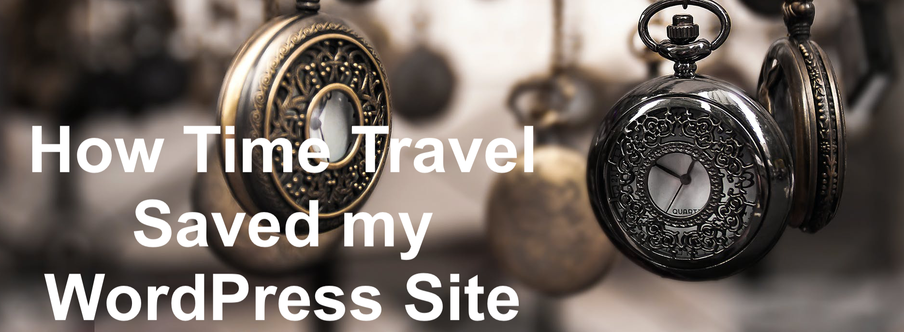

This blog post was meant to be the second part of a 2 part series on creating reactive Mapbox data visualizations, but unfortunately that’s not what it’s going to be. Every great time travel story has a mistake, something so big that the protagonist(s) need to go back in time to stop themselves from making it. Here's mine.

## The Mistake

Last week after I posted part 1 of my Mapbox & React Data Visualizations blog series, I noticed a problem with my WordPress's timezone. The site was in UTC whereas I am in EST. This is a 4-hour difference, large enough where I wanted to correct the problem.

So naturally, I poked around in my WordPress settings, looking for where I could change this and I found it!

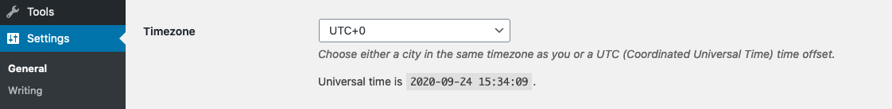

So it was set to UTC +0 and EST is UTC -4, so I’ll just change that real quick and everything will be...

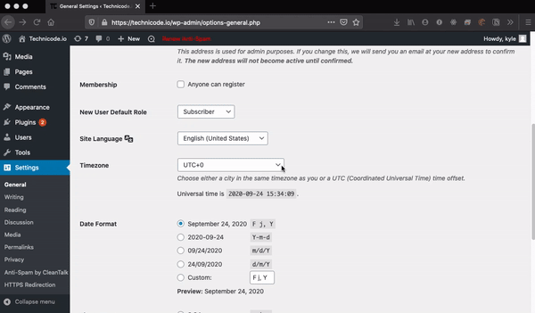

Ummmmmm what just happened??

So at this point, the main public-facing side of the site at https://technicode.io was loading fine. All my blog posts were still visible and accessible, however, my admin console was not. Every time I tried to access the admin console I’d get this:

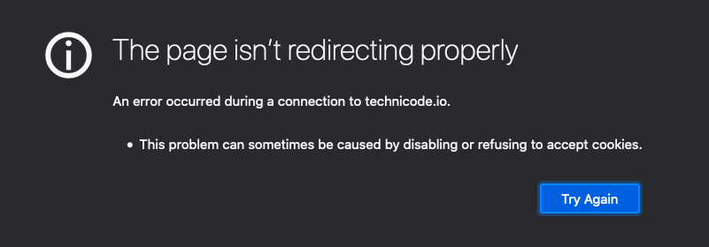

Something was very wrong. Somehow me changing the time zone broke my site entirely. That’s an interesting feature, WordPress! Naturally I rebooted the server to see if that would fix whatever I had just broken but when I tried to access the admin console again, I got the same redirect message.

Now being pretty lost on how to proceed, I turned to Google and was able to find an [article](https://www.wpbeginner.com/wp-tutorials/how-to-fix-error-too-many-redirects-issue-in-wordpress/) which goes over how to resolve this issue!

Perfect! First step?

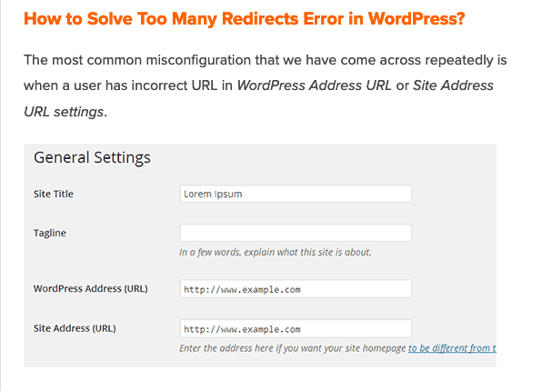

Go to settings in the admin console and change these values! Okay, except I can’t do that because I don’t have access to my admin console.

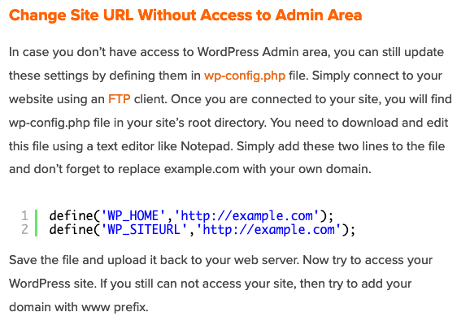

Scrolling a bit further looks like I can make the change in my wp-config.php file awesome!

So I ssh into my AWS Lightsail server, navigate to my wp-config file and open in vim. The necessary entries weren’t included in the file so I went ahead and added them.

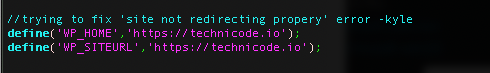

I then saved the file, rebooted the server, and went to check the site:

Shit.

Okay, wait the article said to maybe try www in front of the URLs, I don’t believe I have that subdomain configured but let me give it a try anyway!

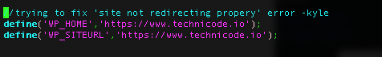

Saved, rebooted aaaaand:

Ugh, still not working. Okay, whats next the article said it could also be an issue with a plugin so maybe that’s it?

I’m sure there's a way to remove plugins from the ssh session but that sounds like it would be a nightmare. I need to somehow get access to my admin console so I can remove the plugins and see if that’s the problem. What I really needed was a time machine.

## The Solution

And then it hit me. I’m hosting my blog on AWS Lightsail, and as a previous IT professional I was smart enough to set up daily snapshots of my server! I can make another instance using a snapshot from before I had the audacity to change the timezone! And then everything would be fine except for my most recent blog post. And sure I could save a copy and repost it, but due to certain restrictions, I need to keep the time stamp of that blog in place of when I posted it.

So first things first, let's bust out the time machine

And by time machine, I mean the snapshots tab on Lightsail.

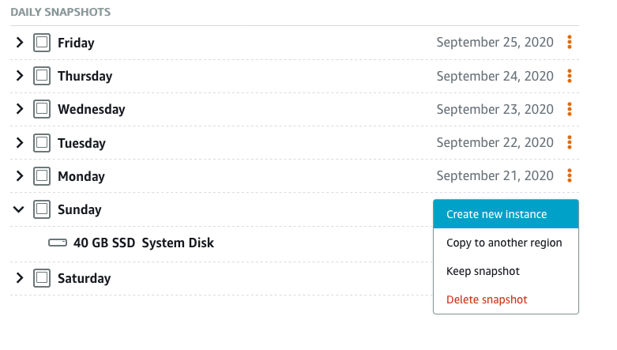

So I'll click on the date I want and create an instance from that snapshot. Once the instance is built, I’ll move my site’s IP over to the new instance. This should provide me with a replica of my site from a week ago that I can sign into that's only missing my most recent blog post.

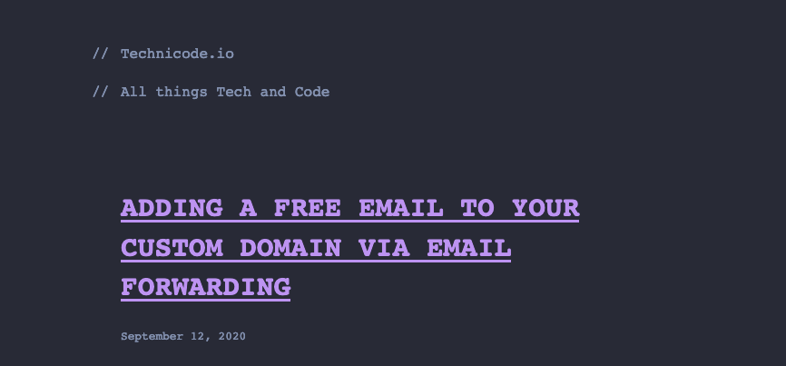

And there we go! We've successfully traveled in time!

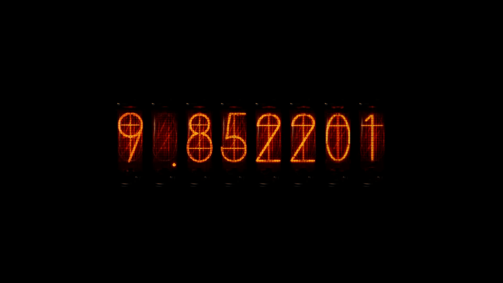

Let’s just confirm I can also get to my admin console aaaaaand

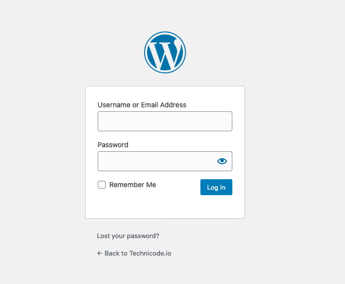

Wooo!!!

Okay now lets clear out all my plugins

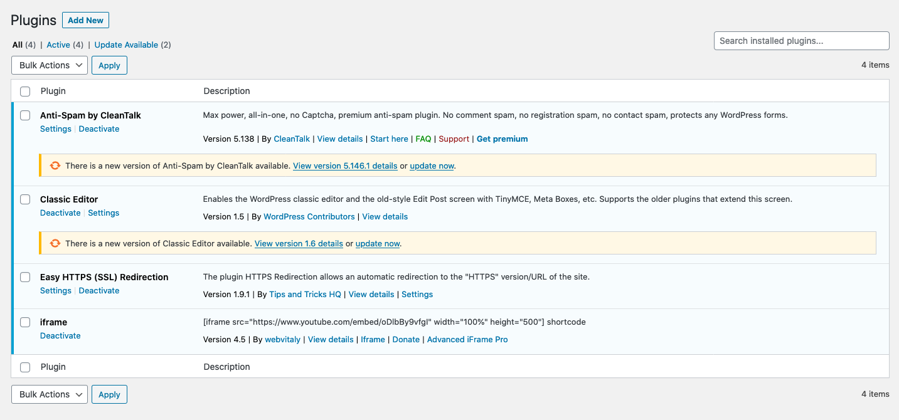

Okay after deleting all plugins, I’ll head back over to my time settings and see if I can update it and then figure out how to get my most recent post back in somehow.

Aaaaand?

Hmmm.

Okay looks like I’m on my own on this one. But at least I know I can revert back to before the change!

This means I might be able to grab a copy of my WordPress database from after the change which has my most current blog post and compare it with the database before the change. Maybe I can just input my new blog post into the working config and worry about the timezone later??

That seems like as fine a place to start as any, so that’s what I’ll do.

## Dealing With Databases

Okay so jumping back to my current broken build, I’ll grab a copy of my WordPress DB via a MySQL dump.

`$ mysqldump -u mysqlusername -p databasename > ~/wpdb_backup.sql`

This command will make a copy of the database and save it to my home folder, where I can grab it off the server via an SFTP client, I use an app called Cyberduck for this.

Now I just need to do the same thing with a snapshot instance from before the mistake! Then I can compare them and see what exactly the differences are.

Once I have both .sql files on my computer I’ll open them in vs code. Right-click on one of the files in the Explorer and click ‘Select for Compare’. 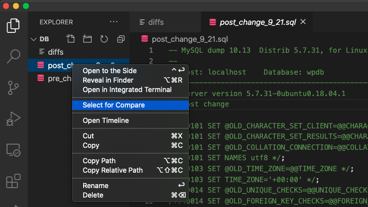

Then right-click on the other file and click ‘Compare with Selected’

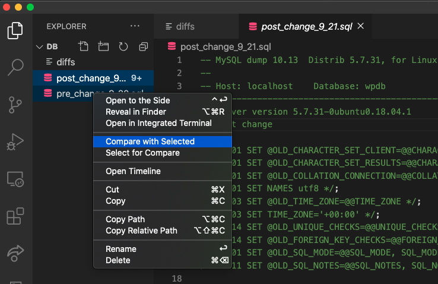

This will allow you to see the differences between both files!

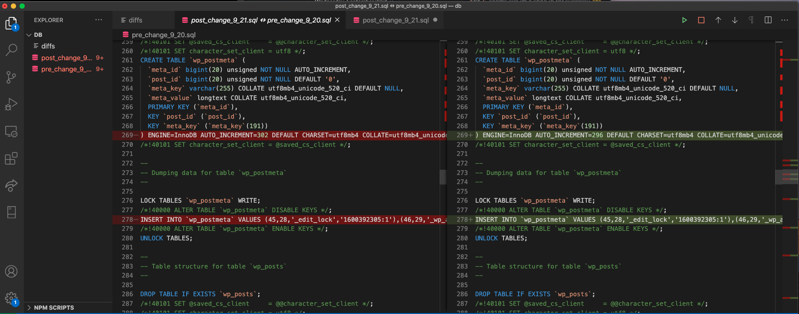

As you can see, each line that doesn’t match is clearly indicated by the red and green. And since I’m not sure which of these changes is causing my problem, I’m just going to grab the data for my newest post and move it over to the backup database so I can get my blog back up to date. Once I have that I can worry about figuring out what caused the problem at another time.

I scrolled through the files and found 3 lines that I wanted to replace in the pre-mistake file. The two lines which were changed in regards to my posts, and then another line which indicated the tags on each post.

I then Saved the file and used Cyberduck to put the file back onto the Lightsail server.

From here I’m able to replace my SQL DB with the fixed file which is aptly named ‘fixed_file.sql’. I did so by running this command:

`$ mysql -u mysqlusername -p databasename < fixed_file.sql`

After putting in my password, I rebooted the server and waited...

Aaaaaaaand...

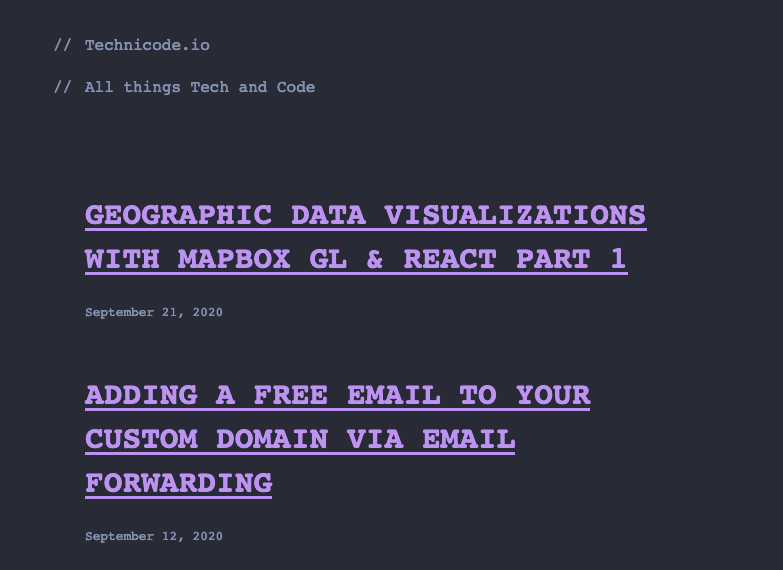

Alright!! Okay and the moment of truth...

WOOOOOOOOO!!!!

Mission successful!!

If you’ve made it this far, the best advice I can give you is to ALWAYS MAKE SURE YOU HAVE BACKUPS!

Unfortunately, Flux Capacitors don't exist. Backups are _actually_ what makes time travel possible. 

Seriously, if I hadn’t set up my server to take daily snapshots, there’s really no way I would have been able to get my site back myself. But luckily, I did! Make sure you do too, or else you’ll probably end up regretting it!
