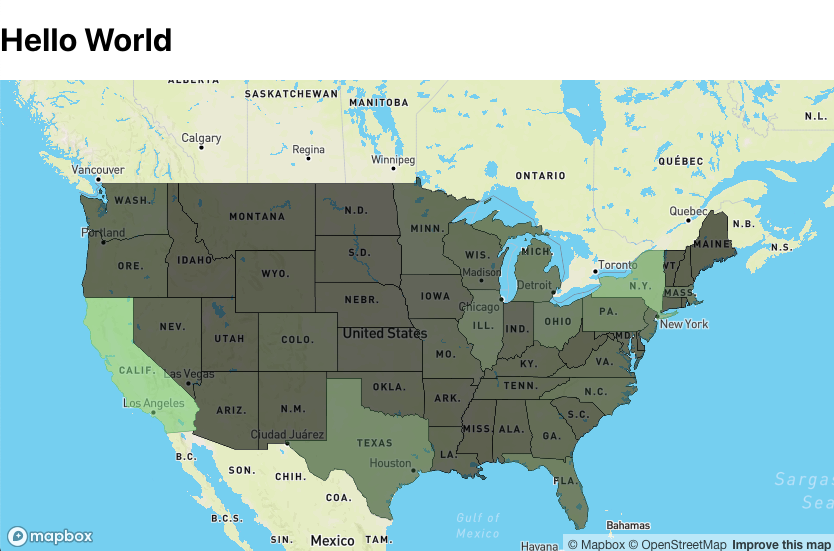
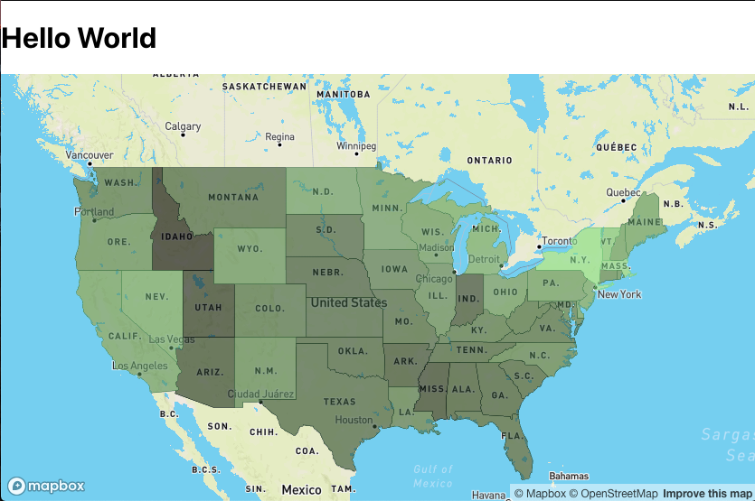
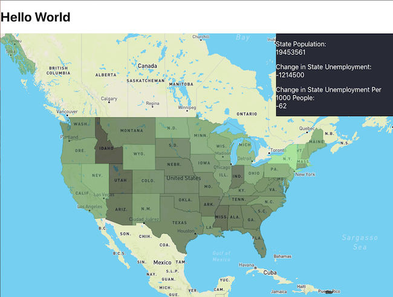

This blog will be a continuation of my previous blog post on geographic data visualizations. You can read my previous post where I explain how to get started with MapBox GL [here](https://technicode.io/index.php/2020/09/21/geographic-data-visualizations-with-mapbox-gl-react-part-1/).

So if you remember from part 1, this is what our map looks like.

Now we can see from this map that it appears the New York and California have been the most affected by unemployment in 2020, however these two states are much more populated than a number of the other states so our data may be a bit skewed. How do we fix this? We'll need to bring in another dimension to our data in the form of population for each state.

I was able to collect the population for each state from July 2020 from [Wikipedia](https://simple.wikipedia.org/wiki/List_of_U.S._states_by_population). Our unemployment data is from August, but July is close enough. So I pulled the population data, made a JSON file and put it in the 'src' folder with the geojson file. I then imported it at the top of the Mapbox component.

`import population from './us-populations.json'`

Now, in the same component, lets head down to the function that handles adding our unemployment data to the source file.

`const addDataToSource= () => states.features.forEach(state=>{ const name = state.properties.name const stateData = props.data.find(item=>(item.State===name)) if(stateData){ let changeInt = parseInt(stateData.Change) if(changeInt<0) changeInt*=-1 state.properties.change = changeInt } })`

the changeInt value is the number of people who lost employment from August 2019 to August 2020 for each state. We'll need to manipulate this value so it is more representative of what we're trying to display. So since we're already iterating through the states, lets grab the population from each state and divide that by 1000, we can then divide the changeInt value by the return of that expression. We'll save this value to a new key in our source data and change state.properties.change to the raw unemployment change value for later.

`const addDataToSource= () => states.features.forEach(state=>{ const name = state.properties.name const stateData = props.data.find(item=>(item.State===name)) if(stateData){ state.properties.change = stateData.Change let changeInt = parseInt(stateData.Change) if(changeInt<0) changeInt*=-1 state.properties.changePerPop = changeInt/(population[name]/1000)

console.log(state.properties.changePerPop) } })` Console logging this should give us something like this:

... 16.80540301865012 45.383400884429534 13.134182851181054 14.977674318424695 40.44824306645567 25.665354341647195 ...

This is great, our visualization will be much more representative with these values. Now to make sure our values play nice with MapBox's stop property, let's throw another parseInt around this value.

`const addDataToSource= () => states.features.forEach(state=>{ const name = state.properties.name const stateData = props.data.find(item=>(item.State===name)) if(stateData){ state.properties.change = stateData.Change let changeInt = parseInt(stateData.Change) if(changeInt<0) changeInt*=-1 state.properties.changePerPop = parseInt(changeInt/(population[name]/1000))

} })`

Since our values are much smaller now, we'll have to adjust the value we pass into the getColors function as well as a few values in that function itself. After a quick skim of our new parsed values, the highest I'm seeing is 75, just to be safe, I'll set my max in the getColors call to 76. We'll also change out fill-color property from 'change' to 'changePerPop'

``map.addLayer({ id:`states-fill`, 'type': 'fill', 'source': `states`, 'paint': { 'fill-color': { property: 'changePerPop', stops: getColors(76) }, 'fill-opacity': 0.6 } })``

Now up to the getColors definition. Since we want 10 color steps to get to our max color, ill divide 76 by 10 to get 7.6. I'll round down and change my increment in this function to 7. I'll also change the value i is being divided by to 7 for each hex componenet. The function should now look like this:

`const getColors=(max)=>{ const arr=[] for(let i=0;i<=max;i+=7){ arr.push([i,rgbToHex(parseInt(i/7 * r/10), parseInt(i/7 * g/10), parseInt(i/7 * b/10))]) } return arr }`

Now our map will look a bit more even and we'll be able to see a more representational visualization of unemployment in each state.

Perfect!

Now we just have to add a MapBox 'mousemove' listener and our component to display the moused-over state's data!

But first lets make a state variable for our data. I want to display a state's population, the actual change in unemployment from 2019-2020, and the change per 1000 people. so my state var will be an object with these 3 keys.

`const [mouseOverState,setMouseOverState] = useState({ name:'', population:'', change:'', changePerPop:'', })` Then the bottom of the useEffect, we'll add another map.on function and we'll pass in the action which will be 'mousemove', the id of the layer we want to listen on which will be 'states-fill', and a function we want to run when there's a change. The function will get our layer section by running map.getCanvas()/style.cursor = 'pointer' then use that location section to set our mouseOverState var.

`map.on('mousemove','states-fill',e=>{ map.getCanvas().style.cursor = 'pointer'; const name = e.features[0].properties.name setMouseOverState({ name, population:population[name], change:e.features[0].properties.change, changePerPop:e.features[0].properties.changePerPop, }) })`

Now our state var will update any time the mouse moves over a US state on our map. We just need to actually display this changing state on our map!

I decided to just do this in the same Mapbox component above the map ref. Just a div with 3 p tags displaying each of our keys set in the state var. And so this is my return:

`return(`

`

#### {mouseOverState.name}

State Population:  
{mouseOverState.population}

Change in State Unemployment:  
{mouseOverState.change}

Change in State Unemployment Per 1000 People:  
{mouseOverState.changePerPop*-1}

mapContainer.current=el} style={styles} />

)`

I also added some styling to the data div to give it some color and make it display on top of the map. `const dataStyles={ position: 'absolute', zIndex:'1', bottom: '', right: '0', width:'30%', display:'block', color:'white', backgroundColor:'#282a36', }`

At this point, our map is done! We have all our data displaying correctly and are able to mouse over each US state to view that state's unemployment data!

Our map should look like this: 

If you'd like to check out the full code used in this blog, you can do so
