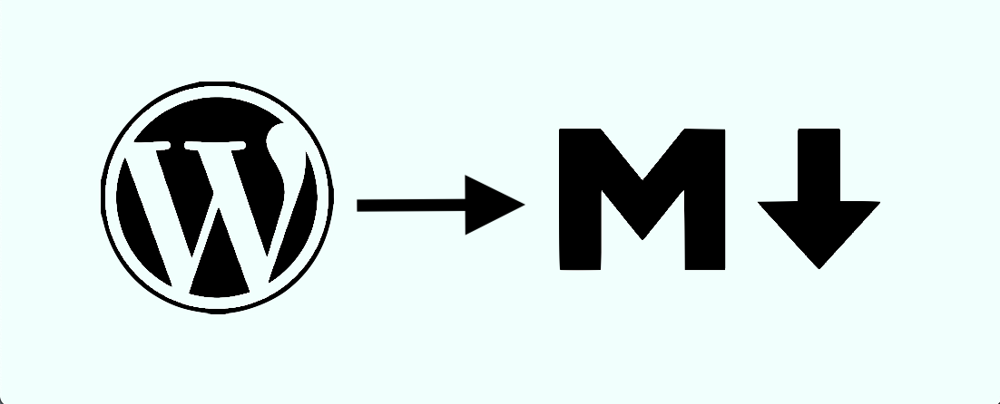
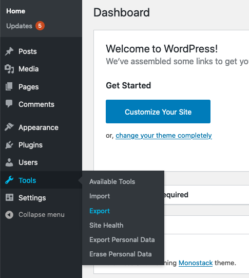
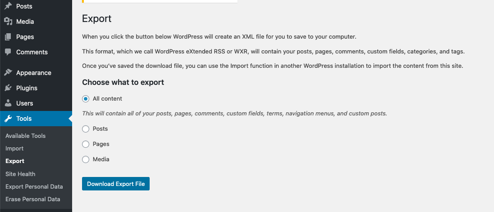
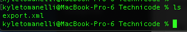
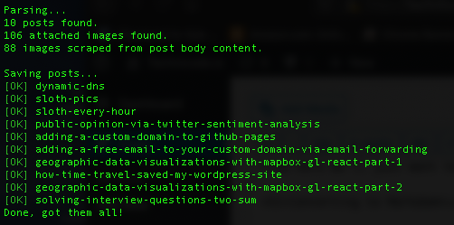
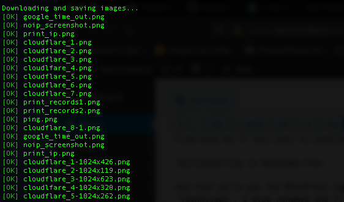
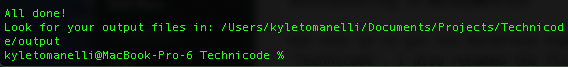
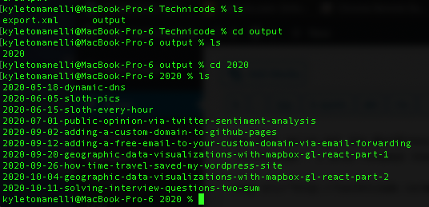
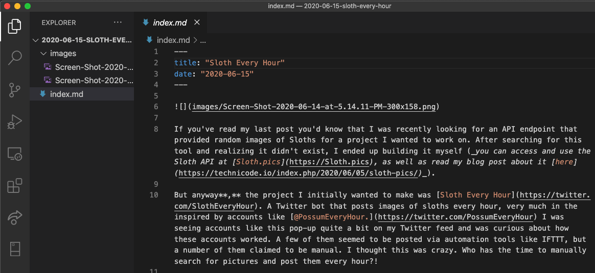
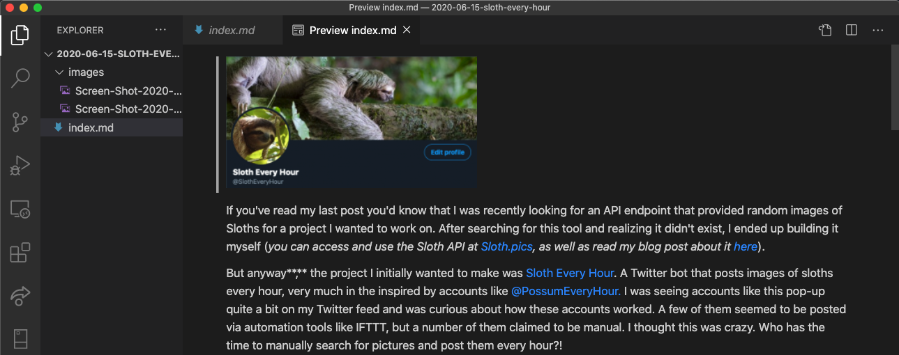

So lately I've been getting more and more fed up with WordPress. The platform is bulky and frankly pretty buggy. You can read my blog post from a couple of weeks ago about how trying to change the timezone on my site completely blew everything up, requiring me to graft parts of my WordPress database onto a backup in AWS Lightsail in order to get back up and running. This was a nightmare. And I'm still dealing with the ramifications of that bug. For Instance, I'm no longer able to use WordPress' block post editor because for some reason the posts won't save. In my opinion, the block editor was actually one of the best parts of the platform. I've had to use the Classic editor since which is essentially just a text field that you can write HTML in, and that's how I've been writing my last few blog posts. This would be fine except for some reason when I'm trying to make a code block in HTML, WordPress drops all the white space from my code making it pretty unreadable. This being a pretty big issue for a blog called Technicode.

So at this point, I've decided enough is enough. I'm moving off the platform and finding a better solution.

I really only started using WordPress as part of my Software Engineering Bootcamp. As part of the program we needed to make technical blog posts during every module of the curriculum and many from my cohort decided to opt for just posting on Medium, and that's fine for them but I knew if I was going to be making blog content I wanted to own it. So being in the middle of an SE Bootcamp I didn't exactly have the extra time to look into how to put together a blog platform that I could work with and so I ended up at WordPress. And honestly, it's been fine for what it is, but at this point, I'm 100% ready to move on.

So where do I go?

I could build my own WordPress-esque backend rails app where everything is stored in a database and and served to the frontend but honestly that sounds kinda overkill. I want my blog to be simple, lean, and lightweight. And with that in mind, I think I want to drop the backend/database idea. If I can just get my blog posts converted to markdown, I can just keep them in a folder and then use something like Gatsby to pulln and display each post. On top of this, I'd be able to host out of Github Pages.

The only downside I can see to this system would be having to write every new blog post in markdown, which wouldn't be too bad, but maybe I can make some simple editor to make it easier if it turns out to be too much of a pain.

Either way, I think for now just converting my current site content to markdown would be a great place to start. And luckily I found a package that will do exactly that!

The package is called [wordpress-export-to-markdown](https://github.com/lonekorean/wordpress-export-to-markdown) and it does exactly what I'm looking for. I just need to export my site's content through WordPress' built in export tool!

## Exporting WordPress

Okay so in order to get our WordPress export, we need to go to our WordPress admin console. From here hover over 'Tools' on the sidebar and then click 'Export'.

Which will take us to this page:

From here we'll just want to confirm we're exporting all content and then click 'Download Export File'. This will initialte the download.

## Converting to Markdown

Now that we've got the WordPress export, lets move it to a folder we want to run the converter from. I moved mine to a folder called 'Technicode'. I also renamed the file 'export.xml' as that is the default file name the converting package looks for.

Now while in this directory in terminal, we can run the following line to start the conversion.

`npx wordpress-export-to-markdown`

The program will run, and ask some yes or no questions about how you'd like your data stored.

The questions are below:

`? Path to WordPress export file? (export.xml)`

`? Path to output folder? (output)`

`? Create year folders? (y/N) y`

`? Create month folders? (y/N) N`

`? Create a folder for each post? (Y/n) Y`

`? Prefix post folders/files with date? (y/N) y`

`? Save images attached to posts? (Y/n) Y`

`? Save images scraped from post body content? (Y/n) Y`

Once you answer all the questions, the script will parse your XML file and convert your blog posts.

And depending on your choices to the questions will also download the images for each post.

Once it's complete you'll have an output folder full of all your wordpress data in markdown format.

And each post folder will contain an images folder as well as an 'index.md' file which is the blog post converted to markdown!

And opening one of the files in VSCode, we see the .md file.

We can also see a preview as well!

Awesome! Now that I've got my blog content in a more flexible format I'll be able to build my own frontend and move off WordPress entirely!

I'm looking forward to continuing this project so make sure to check back to stay up to date on the process!
