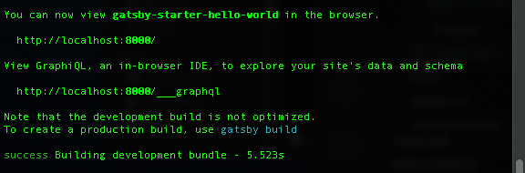
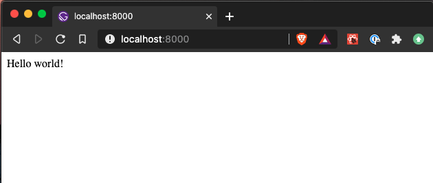
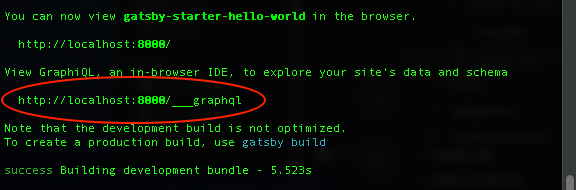
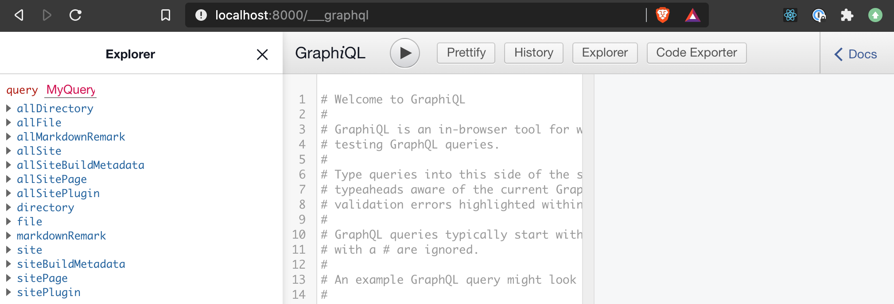
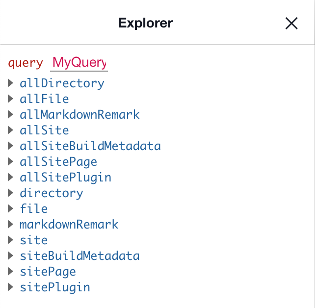
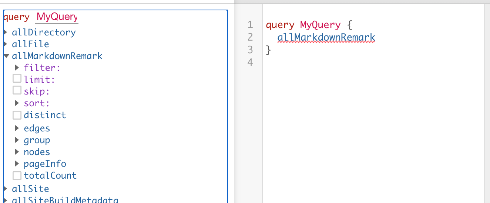
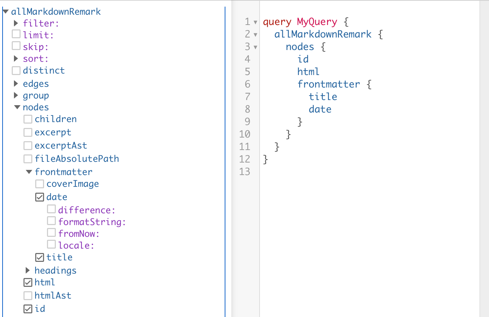
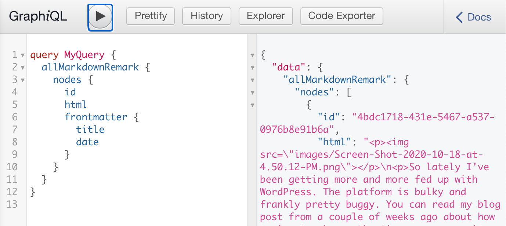
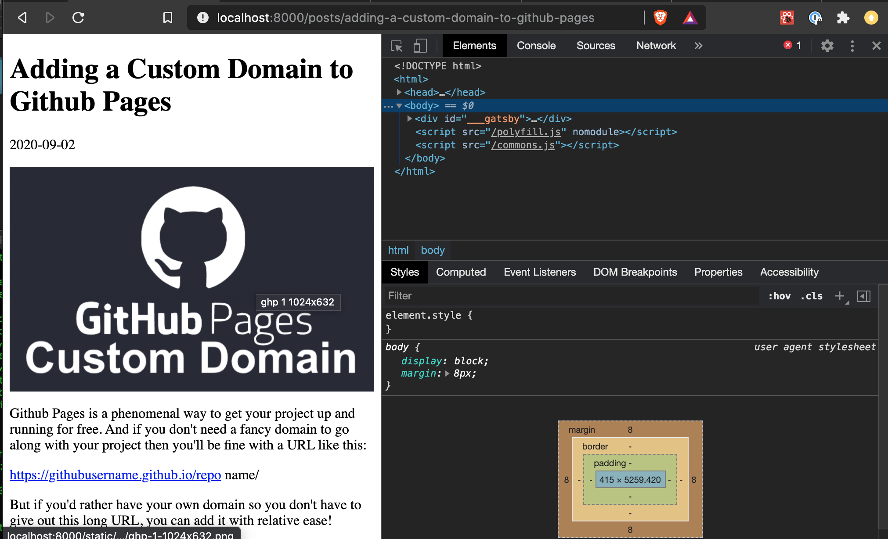
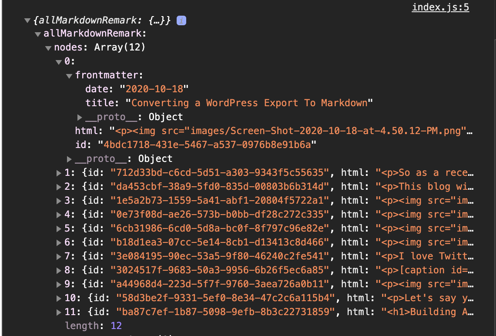

In my last blog post I walked through how to convert a WordPress export to markdown. In this post I'll be using those markdown files along with Gatsby to rebuild Technicode.io.

So let's get started.

## Setting Up Gatsby

First we'll need to make sure we have the Gatsby CLI installed, to do so run the following command from your terminal:

`$ npm install -g gatsby-cli`

Once we have the CLI tool installed we'll be able to create a new Gatsby project from the command:

`$ gatsby new <projectName> <starterTemplate>`

the projectName will be the name of the directory all the files are created in, and the starterTemplate will be a url which leads to a particular gatsby template. For this project, I'm going to use Gatsby's hello world starter which can be found [here](https://github.com/gatsbyjs/gatsby-starter-hello-world). So my gatsby new command will look like this:

`$ gatsby new technicode https://github.com/gatsbyjs/gatsby-starter-hello-world`

This will build a new Gatsby project in your current directory. Once the build completes, go ahead and cd into the directory, open files in your choice of code editor, and then run:

`npm start`



Once your terminal indicates that your server is live at 'http://localhost:8000', you can check everything is working by opening your browser and going to the the site.



As you can see above, the site is live and is displaying 'hello world'. Great, working so far!

Now lets go grab those markdown files from my last blog and throw them in the 'src' folder in our gatsby project. My directory looks like this:

src>posts>{all my blog posts}

## Gatsby Plugins

Now we'll have to install a gatsby plugin called 'gatsby-source-filesystem' which will allow gatsby to use our markdown files. We'll also need another plugin called 'gatsby-transformer-remark' which will be able to convert the markdown to HTML, making it easier for us to include in our site.

To install these plugins, run:

```
npm install
gatsby-source-filesystem
gatsby-transformer-remark
gatsby-remark-images
gatsby-plugin-sharp
```

Then head over to the 'gatsby-config.js' file.

It should look something like this:

```
module.exports = {
  /* Your site config here */
}
```

Inside this module.exports we're going to add a plugins array. This array is where all our plugin config data will live, so to start we'll put 'gatsby-plugin-sharp' as the first item in the array. Then in order to get the 'gatsby-source-filesystem' plugin up and running, we'll need an object containing a resolve key which has a value of 'gatsby-source-filesystem', and an options object which contains keys for 'name' which dictate the name we'll be able to access our filesystem by, as well as a path to those files.

After adding these values, my plugins array looks like this:

```
plugins: [
    'gatsby-plugin-sharp',
    {
      resolve:'gatsby-source-filesystem',
      options:{
        name: 'posts',
        path: `${__dirname}/src/posts`
      }
    }
  ],
```

We'll also need to add another entry in the plugins array for the 'gatsby-transformer-remark' plugin. This will be another object with resolve value of 'gatsby-transformer-remark, and options key-value pairs but we'll also add another plugins array within this object. And in that sub-plugins array, we'll add another object with a resolve value of 'gatsby-remark-images', and options object with a maxWidth key-value pair.

```
{
    resolve: `gatsby-transformer-remark`,
    options: {
      plugins: [
        {
          resolve: `gatsby-remark-images`,
          options: {
            maxWidth: 1200,
          },
        },
      ],
    },
},
```

So the full plugins array should look like this:

```
plugins: [
    'gatsby-plugin-sharp',
    {
      resolve:'gatsby-source-filesystem',
      options:{
        name: 'posts',
        path: `${__dirname}/src/posts`
      }
    },
    {
      resolve: `gatsby-transformer-remark`,
      options: {
        plugins: [
          {
            resolve: `gatsby-remark-images`,
            options: {
              // It's important to specify the maxWidth (in pixels) of
              // the content container as this plugin uses this as the
              // base for generating different widths of each image.
              maxWidth: 1200,
            },
          },
        ],
      },
    },
  ],
```

## GraphQL

So now that our plugins are all set, we'll have to set up a GraphQL query to pull our data from the source files to access them in the React components.

Now in order to help build our query, gatsby provides us with a tool called Graphiql, which is accessible at 'http://localhost:8000/\_\_\_qraphql' by default. You may have seen this url when you first started your gatsby app.



Navigating to this url while the server is running, we get this:



On the left side of the window you'll see a list of potential querys that we can perform in our project.



And by clicking on a particular query option it will build the query in the text field.

The data I'm looking for is in the 'allMarkdownRemark' option, so I'll click the dropdown arrow for that option. As you can see, 'allMarkdownRemark' then appears in the query text.



Then from that dropdown, I'll select the 'nodes' option which is an array of my markdown files. And for each node, I need the Id, the HTML, and the frontmatter date and title.



Clicking the 'play' button at the top will actually perform this query, allowing us to confirm we're getting all the data we need.



## Gatsby createPages()

Now that we know we've got a working graphql query, lets copy the query and paste it into a file called 'gatsby-node.js'. If the file doesn't exist go ahead and make it in the root of the project directory.

we'll wrap out query in an async function that destructures 'actions', and 'graphql' from its parameters. We'll also assign a const called data to the awaited value of our graphql query, and set the whole function equal to 'exports.createPages'. Your 'gatsby-node.js' should look like this:

```
exports.createPages = async({actions,graphql})=>{
    const {data} = await graphql(`
    query MyQuery {
        allMarkdownRemark {
          nodes {
            id
            html
            frontmatter {
              title
              date
            }
          }
        }
      }
    `)

}
```

Great! So this will handle retrieving the blog posts and next we'll have to tell gatsby what to do with each post.

We'll be using Gatsby's createPage function for each post so we can link to that post from elsewhere on the site.

So right under this we'll iterate through the data returned by the query, create a 'slug string' which will be the url path to the particular post, then we'll call actions.createPage() and pass it an object containing a url path, a component template, and a context object. The url path will just be our slug string, the component template will be made in our next step but we'll point to the location we're going to put it, and then the context is an optional arg that will be passed to the component and be able to be used to collect all necessary data for the particular post, so we'll pass the post id.

```
    data.allMarkdownRemark.nodes.forEach(post=>{
        const slug = post.frontmatter.title.replace(/\s+/g, '-').toLowerCase()
        actions.createPage({
            path:`/posts/${slug}`,
            component:require.resolve('./src/templates/post.js'),
            context:{id:post.id},
        })
    })
```

## Gatsby Post Template

So now lets make our component template. As you can see from the component key value pair, we're going to make a folder in our 'src' folder called templates, and then make a 'post.js' file in that folder.

Our post.js file will really only have two functions: a graphql query searching for the post with the corresponding id for that gatby page, and an actual component function that will take in the data from the query and return it so it'll acutally display on the page.

This is what post.js should look like:

```
import React from 'react'
import {graphql} from 'gatsby'

export default function Post({data}){
    const post = data.markdownRemark
    return<div>
        <h1>{post.frontmatter.title}</h1>
        <p>{post.frontmatter.date}</p>
        <div dangerouslySetInnerHTML={{__html:post.html}}/>
    </div>
}

export const query = graphql`
query($id:String!){
    markdownRemark(id:{eq:$id}){
        html
        frontmatter{
            title
            date
        }
    }
}
`
```

Notice that this graphql call doesn't have parenthesis like the one in gatsby-node.js. This is because when in a react component, react allows for use of [tagged templates](https://developer.mozilla.org/en-US/docs/Web/JavaScript/Reference/Template_literals) which you can read about more here.

Now lets try going to one of the post urls and see what we get.



Awesome! Now that we have the pages for our posts being built, we just need the index page which links to all of them.

## Post Index Page

In our index.js file we'll need to make 1 more graphql query to collect the full list of posts to display on the home page.

This query should be pretty much the same as our first query but without the html value:

```
export const query = graphql`
  query MyQuery {
    allMarkdownRemark {
      nodes {
        id
        frontmatter {
          title
          date
        }
      }
    }
  }
`
```

Next we'll need to let's destructure 'data' from props in the Home component in index.js and console log data to confirm we're getting everything we need.

```
export default function Home({data}) {
  return <>
    {console.log(data)}
    Hello world!
  </>
}
```

Going back to localhost:8000, we're able to see all the data being logged in the console:



Perfect! Now we'll just have to map through and return the title and date for each post, and instead of wrapping each in an \<a> tag pointing to 'show' page, we'll use a Gatsby \<Link> tag with a 'to' property pointing to the post slug string url.

```
export default function Home({data}) {
  const posts = data.allMarkdownRemark.nodes
  return <>
    <h1>// Technicode.io</h1>
    <p>// All things Tech and Code</p>

    {posts.map(post=>{
      const title = post.frontmatter.title
      const slug =`/posts/${title.replace(/\s+/g, '-').toLowerCase()}`
      const date = new Date(Date.parse(post.frontmatter.date))
      return(
      <div key={post.id}>
      <Link to={slug}>
      <h2>{title}</h2>
      </Link>
      <p>{date.toDateString()}</p>
      </div>)
    })}
  </>
}
```

This will display each post's title and date posted, allowing us to click between each post to view.

Now, aside from some styling, the blog site is done! I'm completely off WordPress, in fact I've written this entire blog post in markdown rather than in WordPress' editor and it's been a much more enjoyable experience.

Now I'm looking forward to making some blog posts that aren't about issues with my blog site!

If you'd like to look at the code for this blog/site, you can do so [here](https://github.com/ktomanelli/Technicode.io)
