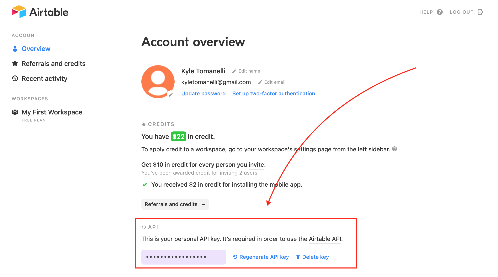
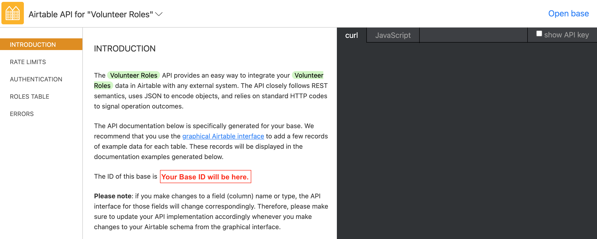
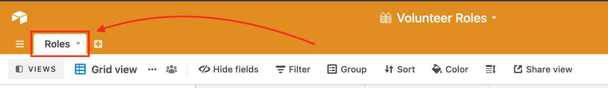

I'm currently working with a team of volunteers on a project designed to be a sort of local community bulletin board for volunteer groups around Astoria NY. This site will mainly be used to list open roles for the various groups in the community, and in order keep data management simple and user friendly, we'll be using Airtable to house all the listing data. Another perk of using Airtable is that it provides you with the ability to make 'form views' which make adding new data to the sheet much easier/user friendly. They also allow you to embed the form into an external website which means there'll be no need to build out post functionality on the backend to for adding new data to the sheet, all of this will be handled by the form embed.

So this project as of right now is looking like a gatsby front end and a small node backend. I'll just be focusing on the backend in this blog, particularly airtable integration and using it to retrieve records from a table.

Let's get started.

# Environment Variables

So to get started let's go over the env variables we'll need to grab before we can make use of the Airtable API.

### 1.) AirTable API Key

You'll be able to grab this key from [https://airtable.com/account](https://airtable.com/account).



### 2.) AirTable Base ID

You'll also need the unique id for the Airtable base you're trying to work with. You can get your base ID by going to [https://airtable.com/api](https://airtable.com/api) and then clicking on the relevant base. Your base id will be displayed on the page.



Great! Now you'll want to export those keys in your terminal or make a .env file and keep them there.

# Airtable API

Okay so now lets run `npm init` to initialize our node project, and once that's done, we'll have to install 'airtable' and 'express'.

`npm i airtable express`

Once that's complete lets make a JS file and open it in our editor.

Now lets start by requiring the airtable package.

```
const Airtable = require('airtable');
```

Next we'll declare a new Airtable object and pass in our API key as well as our base id. We can do so like this:

```
const Airtable = require('airtable');

const base = new Airtable({ apiKey: process.env.AIRTABLE_API_KEY }).base(
  process.env.AIRTABLE_BASE_ID
);
```

Next we'll need to grab our table name. You can get this by just going to your Airtable base and seeing what the tab at the top is named.



Mine is named 'Roles'.

So we'll call .table() on base and pass in our table name:

```
base.table('Roles')

```

Be aware that the table name is case sensitive!

Next we'll call .select() and here we'll be passing in an object. This object can have a number of optional key-value pairs, of which you can read more about [here](https://airtable.com/api) but one that will be required for us will be the 'view' key-value pair.

This tells airtable what view we'd like to focus on. By default your airtable should have a view called 'Grid view'. This is what I'll be using as my view value.

```
    base
      .table('Roles')
      .select({
        view: 'Grid view',
      })
```

Now that we have the correct table and view, we can call the .all() method and this will return all the records in this table.

This is certainly useful, but I think I'll only need the records that meet certain criteria. We have two columns in the table that I'd like to check before returning the results of the .all() call. And I could certainly use a .filter() to sift through any records I won't need but a cleaner way to filter with Airtable is to use a filterByFormula.

A filterByFormula is an optional key-value pair that we can add to our .select object which will filter the returned records according to a formula we pass in. This way we'll only receive records that pass through the formula. You can read up on filterByFormula [here](https://support.airtable.com/hc/en-us/articles/203255215-Formula-Field-Reference).

The formula I'll be using will be checking that a record has a 'Status' of 'open' and a 'Is it approved?' of '1'. The 'Status' and 'Is it approved?' correspond to columns in the table and the 'open' and '1' are the values we want our returned records to have. So my code will look like this:

```
  base
    .table(process.env.AIRTABLE_TABLE_NAME)
    .select({
      view: 'Grid view',
      filterByFormula: "AND({Status} = 'open',{Is it approved?} = '1')",
    })
    .all();
```

We can confirm this is working by wrapping the code in a function and awaiting the results of the code which returns a promise:

```
const getOpenRoles = () =>
  base
    .table(process.env.AIRTABLE_TABLE_NAME)
    .select({
      view: 'Grid view',
      filterByFormula: "AND({Status} = 'open',{Is it approved?} = '1')",
    })
    .all();

const test = async () => {
  console.log(await getOpenRoles());
};
test();
```

This will log all the relevant records to the console.

Let's get rid of the test function and the test call and instead add a module.exports statement and set it equal to our getOpenRoles function. Our final code should look like this:

```
const Airtable = require('airtable');

const base = new Airtable({ apiKey: process.env.AIRTABLE_API_KEY }).base(
  process.env.AIRTABLE_BASE_ID
);

const getOpenRoles = () =>
  base
    .table(process.env.AIRTABLE_TABLE_NAME)
    .select({
      view: 'Grid view',
      filterByFormula: "AND({Status} = 'open',{Is it approved?} = '1')",
    })
    .all();

module.exports = { getOpenRoles };
```

Now we'll be able to call this function from other files.

# Express

Let's make another file called 'http.js'

in this file, we'll set a var, express, to require('express'), and another variable, app, equal to express(). We'll also destructure out getOpenRoles function from 'airtable.js'

```
const express = require('express');
const { getOpenRoles } = require('./airtable');

const app = express();
```

From here we'll just need to make our route and tell express what port we want it to listen on. So to make our route, we'll do app.get() and pass in our desired url,'/api/getOpen', and a function we want to run when someone hits the url. For this instance we'll be using an async function which will return the awaited response from our getOpenRoles function.

We'll then call app.listen() and pass in 3000.

The file should now look like this:

```
const express = require('express');
const { getOpenRoles } = require('./airtable');

const app = express();

app.get('/api/getOpen', async (req, res) => {
  res.json(await getOpenRoles());
});

app.listen(3000);
```

And this is it, now if we run our http.js and go to localhost:3000/api/getOpen, we'll receive a json object containing all the records that are approved and have a status of open. We can now leverage this api with our Gatsby frontend to display this data neatly on the page.
