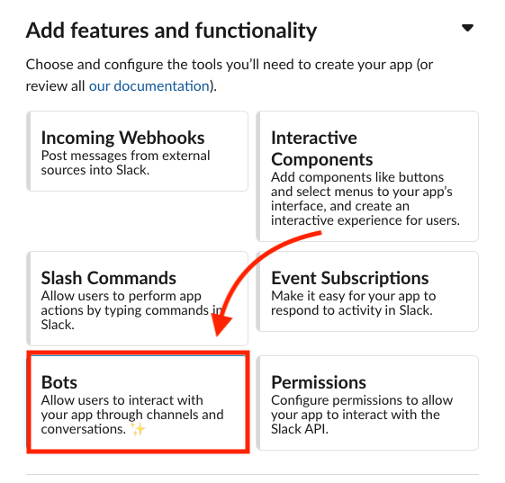
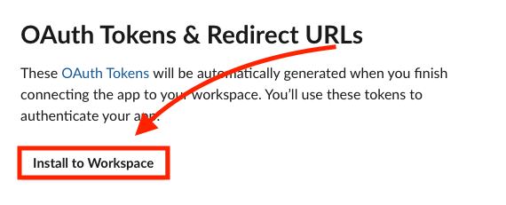

Slack has become an absolute necessity in the professional environment as well as for smaller non-professional groups. The convenience of having everyone in your organization in one place makes communication infinitely easier. And no matter what kind of slack group you may find yourself in, you'll probably end up making use of one of the hundreds if not thousands of Slack apps which serve to extend slack's functionality. There are Slack apps for Zoom, Github, Zapier, you name it. But when it comes to some of these tools they're not always as flexible as one might desire.

With this post I'll be starting a new blog series on the Slack API and how it can be leveraged to build your own useful and intuitive apps that make your slack channels a bit more lively. To start, I'll go over getting an app set up and having it send messages to a channel.

Lets get started!

## Slack App Setup

So, first you'll need a Slack workspace to develop and test in. You can create one [here](https://slack.com/get-started#/create). You'll need to put in your email, a verification code and then name your group.

Once you have your slack workspace up and running, we'll head over to [https://api.slack.com/apps](https://api.slack.com/apps) and click 'Create an App'. You'll have to give your app a name and select your workspace from the dropdown. Since this blog is just about the basics of getting set up I think we'll make a cat bot that meows every so often, so I'll name my app 'Cat'.


Once the app is created, you should be at this screen:


Now that the app is created, we'll need to give it the correct permissions for what we want to be able to do. So let's scroll down to the section labelled 'Add features and functionality' and click 'Bots'.



This will bring us to the 'App Home' page where we will be able to add a scope to our bot by clicking 'Review Scopes to Add'


On this page is where we'll actually provide our bot with it's permissions. Go ahead and scroll down to the 'Scopes' section. Since we haven't added any permissions yet it should look like this:


Now, the scopes we'll have to provide our bot with are 'channels:join', which allows our bot to join a channel in the workspace, 'channels:read', which allows the bot to view basic info about the channels in the workspace such as the channel ID, and 'chat:write' which allows the bot to send messages in the channel. Go ahead and click 'Add an OAuth Scope' and select these three from the drop down.

After adding these 3 scopes, your Scopes section should look like this:


Next, you'll have to scroll up to the top of the page and click 'Install to Workspace', this is what actually adds the app's access to your workspace.



Then click 'Allow'.


Once you finish the install you'll be redirected to your app's 'OAuth & Permissions' page. It's here that you'll be able to grab your Bot's OAuth Access Token. We'll need this to actually code our bot.


Now that we have our bot's OAuth token and our app installed to the workspace, we can leave Slack's site and jump into our code editor to actually build the bot's functionality.

## Building the Bot

In the terminal, make a new directory, and run `npm init` and go through the basic npm setup. Once that's complete go ahead and run `npm install slack`.

Once that's done, go ahead and make an index.js file. This is where we'll actually write the code our bot will be running.

To start, we'll declare a const 'Slack' and set it equal to a require statement for the 'slack' package.

`const Slack = require('slack');`

We'll then set our bot token from earlier to another const we'll call 'token'. I'm using an evironment variable here as it's a safer option for api keys but you don't have to.

`const token = process.env.SLACK_BOT_TOKEN;`

And then we'll create a new Slack object and pass in our token.

`const bot = new Slack({ token });`

From here we can call any methods our bot has access to. You can look into the methods available [here](https://api.slack.com/methods).

What we want to be able to do, is run the 'chat.postMessage' method which, from it's page in the [docs](https://api.slack.com/methods/chat.postMessage), requires 3 parameters: a token (which will be automatically attached to each method we run because we're making our calls with the Slack object rather than without), a Channel ID, and the text we want to send.

We can get the Channel ID from the url of our slack channel, but in order to get more familiar with the API, lets try to get it programatically.

Quickly going the that methods doc I linked above, I see a method that may be of use to us: 'conversations.list()'. Let's give this one a try and see what our output is.

```
const Slack = require('slack');

const token = process.env.SLACK_BOT_TOKEN;
const bot = new Slack({ token });

bot.conversations.list().then(console.log);
```

And here is my console output:

```
kyletomanelli@MacBook-Pro-6 slack-cat % node index.js
{
  ok: true,
  channels: [
    {
      id: 'C01FNB76YAH',
      name: 'general',
      is_channel: true,
      is_group: false,
      is_im: false,
      created: 1606688135,
      is_archived: false,
      is_general: true,
      unlinked: 0,
      name_normalized: 'general',
      is_shared: false,
      parent_conversation: null,
      is_ext_shared: false,
      is_org_shared: false,
      shared_team_ids: [Array],
      pending_shared: [],
      pending_connected_team_ids: [],
      is_pending_ext_shared: false,
      is_member: false,
      is_private: false,
      is_mpim: false,
      topic: [Object],
      purpose: [Object],
      previous_names: [],
      num_members: 1
    },
    {
      id: 'C01FRKVGQ3D',
      name: 'random',
      is_channel: true,
      is_group: false,
      is_im: false,
      created: 1606688135,
      is_archived: false,
      is_general: false,
      unlinked: 0,
      name_normalized: 'random',
      is_shared: false,
      parent_conversation: null,
      is_ext_shared: false,
      is_org_shared: false,
      shared_team_ids: [Array],
      pending_shared: [],
      pending_connected_team_ids: [],
      is_pending_ext_shared: false,
      is_member: false,
      is_private: false,
      is_mpim: false,
      topic: [Object],
      purpose: [Object],
      previous_names: [],
      num_members: 1
    }
  ],
  response_metadata: { next_cursor: '' }
}
```

Great, an array of all the channels in the workspace! We can just pick the channel we want to send from and save that channel ID as a variable that we can use.

So if I want to send messages to General, I'll copy 'C01FNB76YAH' from my output and save it as an environment variable. Which allows me to add the following line to my code.

`const channel = process.env.SLACK_CHANNEL_ID;`

So now that we have our channel ID, let's try sending a message to that channel using that 'chat.postMessage' method.

`bot.chat.postMessage({ channel, text: 'meow' });`

running our code again aaaannd...

```
kyletomanelli@MacBook-Pro-6 slack-cat % node index.js
(node:5779) UnhandledPromiseRejectionWarning: Error: not_in_channel
    at exec (/Users/kyletomanelli/Projects/slack-cat/node_modules/slack/src/_exec.js:11:15)
    at Object._execWithToken (/Users/kyletomanelli/Projects/slack-cat/node_modules/slack/src/_factory.js:31:16)
    at Object.<anonymous> (/Users/kyletomanelli/Projects/slack-cat/index.js:11:10)
    at Module._compile (internal/modules/cjs/loader.js:1123:30)
    at Object.Module._extensions..js (internal/modules/cjs/loader.js:1143:10)
    at Module.load (internal/modules/cjs/loader.js:972:32)
    at Function.Module._load (internal/modules/cjs/loader.js:872:14)
    at Function.executeUserEntryPoint [as runMain] (internal/modules/run_main.js:71:12)
    at internal/main/run_main_module.js:17:47
```

Oh no! We got an error, but luckily the Slack API has our back. We can see the problem in that first line.

`(node:5779) UnhandledPromiseRejectionWarning: Error: not_in_channel`

The bot isn't in the channel we're trying to post in, so we can certainly just open up slack and manually add our bot to the channel, but once again lets try to do this programatically!

I found another method 'conversations.members', which appears to return a list of all the members in the channel, as well as another method 'conversations.join', which will join the specified channel. So we can run a check to see if our bot is in the channel, and if not, set it to join. And once we're in the channel, we'll be able to send our message.

So let's take a look at that members list:

`bot.conversations.members({ channel }).then(console.log);`

```
kyletomanelli@MacBook-Pro-6 slack-cat % node index.js
{
  ok: true,
  members: [ '<my-user-id>' ],
  response_metadata: { next_cursor: '' }
}
```

(I've censored my user id)

Okay so only 1 user ID is showing in the members list and it's mine. So I need to somehow get the bot's user ID so I can check whether or not it's in the channel.

Luckily there's another method we can use to get basic IDs for our bot. 'auth.test' is mainly used to confirm you're authenticating correctly but it also returns a user_id which we can make use of.

`bot.auth.test().then(console.log);`

```
kyletomanelli@MacBook-Pro-6 slack-cat % node index.js
{
  ok: true,
  url: 'https://kylesdevelopmentslack.slack.com/',
  team: "Kyle's Development Slack",
  user: 'cat',
  team_id: '<bot-team-id>',
  user_id: '<bot-user-id>',
  bot_id: '<bot-id>'
}
```

(I've censored my these user ids as well)

Great! I'll grab the bot-user-id and save it as another environment variable called 'userId'. Then I'll modify our conversations.members method call to check for userId and call conversations.join if it's not present.

To make it easier I decided to make an async function which awaits the members list. This is the function I wrote:

```
const join = async () => {
  const data = await bot.conversations.members({ channel });
  if (!data.members.includes(userId)) {
    bot.conversations.join({ channel });
  }
};
```

Great! So now our bot is checking if it's in the channel, and then joining if not.

And calling that conversations.members method again I'm now seeing another user listed in the channel. (It may be important to note that the new user ID being listed in the channel list will not be the same as your App ID, so don't worry if it's different.) You can still confirm the bot is in the channel by actually checking your channel in your browers or your slack app. You should see a message that says your app has joined the channel:


Great! Now let's try sending our message again!


Wooo!! We have our cat bot meowing!

At this point, we're pretty much done. We've built a simple slack bot that can check to see if it's in a specified channel, join that channel if not, and send messages to that channel. You can take this barebones framework and run with it to build some really neat things. For example, let's say I didn't just want a slack bot that would meow when I run it. I want a slack bot that, like a real cat, will meow at me randomly throughout the day.

To do this I would wrap the postMessage in a function called 'meow' and declare a variable called nextMeow and set it to Date.now() + a random amount of time. I'd then use a setInterval set to run every 10 minutes or so and check to see if that time stored in nextMeow had passed and if it had, I'd call our meow function and set a new nextMeow time.

These functions would look something like this:

```
const meow = () => bot.chat.postMessage({ channel, text: 'meow' });

const getNextMeow = () =>
  Math.floor(Date.now() + Math.random() * Math.floor(10000000));

let nextMeow = getNextMeow();

setInterval(() => {
  if (Date.now > nextMeow) {
    meow();
    nextMeow = getNextMeow();
  }
}, 600000);
```

Okay so not entirely useful or productive in any way but hey! At least we built something fun and learned a bit along the way. If you'd like to take a look at the code for this blog you can do so [here](https://github.com/ktomanelli/cat-slack-bot).

I look forward to going over more with the Slack API. Stay tuned!
