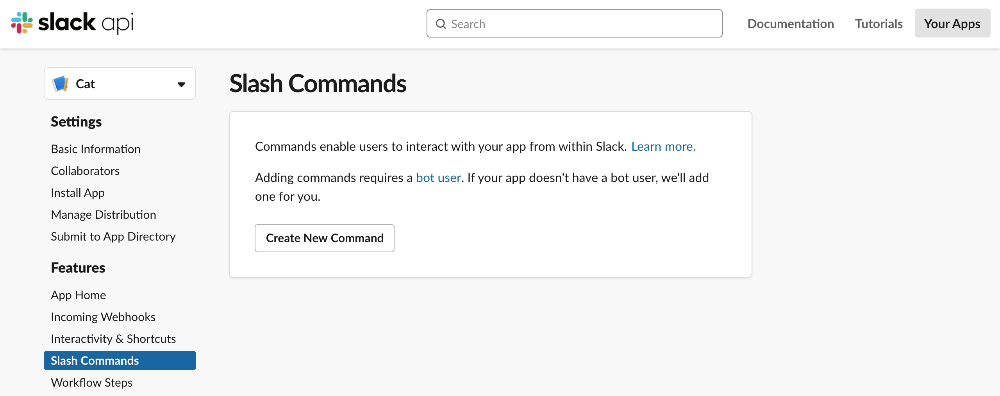

Last week I went over how to get up and running with the Slack API by creating a simple Slack bot. If you'd like to check out that post, you can do so [here](https://technicode.io/posts/slack:-making-a-simple-bot). This week I'm going to go over adding some more functionality to this bot, specifically, slash commands.

Slash commands can be incredibly useful, you can have a slash command reach out to an external api, open a form, or run any kind of function. Since we're still working with the Cat bot, maybe we can implement a couple commands to make the cat a bit more life-like. I'm thinking '/pet' which would make the cat purr, '/feed-cat' which makes the cat sleep, and '/pic' which will reach out to (The Cat API)[https://thecatapi.com/] to grab a picture and send it in the channel.

Before we get started with setting anything up let's go over how exactly Slack's slash commands work.

From the slack client we, the user, type our slack command. Our bot user sees this message and realizes that we're trying to run a command. It then sends a request to a url specified by the app creator, which will point to a server of some sort. This server then will confirm the request is from Slack and not some random person trying to break in, and then run whatever function is tied to that particular command.

So since we know we're going to need a server and a url, we'll have to do some set-up before we can add any slash commands to the bot.

## HTTPS Tunnel

First, since I don't particularly want to host my bot anywhere right now, I'm going to need a way to get a url to point to my local machine.

Luckily there's a tool that does exactly this. It's called (ngrok)[https://ngrok.com/]. This tool will generate a unique URL and make a tunnel between the server that URL points to and our local machine. This allows others, like Slack, to access endpoints at our localhost.

Once you've downloaded ngrok, go ahead and run it with the command `ngrok http 3000`. This will create the tunnel to http://localhost:3000


Awesome! Now lets grab that url from the terminal output and try to access it from out browser.


And as you can see we get an error. We also get some more output in the ngrok terminal window.


We're getting this error because ngrok is pointing to localhost:3000 and we didn't set anything up there yet, but I wanted to show you that every request that comes through this tunnel can be seen in the terminal window along with the status code and path.

## Express

Now that our HTTPS tunnel is up and running let's `npm install express` to the bot's directory and put together a simple web server at localhost:3000 so our tunnel has something to tunnel to.

I'll also `npm install axios` so we can reach out to the cat api for our /pic command.

```
const express = require('express');

const app = express();
app.use(express.json());
app.use(
  express.urlencoded({
    extended: true,
  })
);

app.get('/', function(req, res) {
  res.send('Hello World');
});

app.listen(3000);
```

Starting this server and accessing the ngrok URL again we get...


Perfect! Our tunnel is fully working!

Now on to the slash commands.

## Enabling Slash Commands

So in order to use slash commands with your bot, you'll need to enable slash commands in your slack app dashboard. You can do so by going to [https://api.slack.com/apps/](https://api.slack.com/apps/), selecting your app, and clicking on 'Slash Commands' in the sidebar.

You should see this:



Now we'll go ahead and click the 'Create New Command' button.

You'll be presented with a form for creating your slash command.


The 'Command' field will be what users will type to run your command, the 'Request URL' will be the url Slack will send it's request to when the command is run, 'Description' is just that, a description of what the command does, and 'Usage Hint' are any params you want to allow users to pass to your command.

This is my command after filling out the form:


Notice I added '/slack/' to the end of my Request URL. This isn't necessary, but it's a bit cleaner.

Once your command is set up, go ahead and click 'Save' at the bottom of the screen.

I'll also create commands for the other two commands I mentioned above.


Great! Now any time you add new slash commands in the app dashboard, you need to remember to reinstall your app to your workspace or your changes won't be reflected in your workspace.

Now that I've reinstalled my app, any time someone in a channel with the bot types our command, Slack will send a request to our URL. Let's test this out:


Okay and we get an error, 'dispatch_failed'. Hmmm not a particularly descriptive error. Let's take a look at ngrok to see if we can figure it out.


Okay great, a 404. We don't have a route for post requests at '/slack' so the server returns a 404. Let's jump back to our server and add this route.

## POST to /slack

```
app.post('/slack', function(req, res) {
  res.sendStatus(200);
});
```

And after sending /pet we get:


As a note, whatever you send back as a response to a slash command request will be displayed as an ephemeral message which means only the user who initiated the request will see it. You can use this message as a way to indicate to the user that your bot received the request. You need to make sure you send some sort of response as if no response is sent within 3 seconds the user will see an error whether or not your function has run. So make sure you send back a response!

## Differentiating Between Commands

Now that we have our server receiving and responding to requests, lets start working on getting our commands to do different things! Currently all the commands we set up will trigger the same request/response, so lets see if we can check which command was run and then run a particular function based on the input.

Changing my post route to:

```
app.post('/slack', function(req, res) {
  const { body } = req;
  console.log(console.log(body));
  res.sendStatus(200);
});
```

Console output:

```
{
  token: 'my-token',
  team_id: 'my-team-id',
  team_domain: 'kylesdevelopmentslack',
  channel_id: 'my-channel-id',
  channel_name: 'general',
  user_id: 'my-user-id',
  user_name: 'kyletomanelli',
  command: '/pet',
  text: '',
  api_app_id: 'my-app-id',
  response_url: 'https://hooks.slack.com/commands/my-team-id/1553928153539/my-token',
  trigger_id: 'my-trigger-id'
}

```

And we can see that this object has a 'command' key-value pair which indicates which command was run.

Let's add a switch statement based on that variable.

```
app.post('/slack', function(req, res) {
  const { body } = req;
  switch (body.command) {
    case '/pet':
      break;
    case '/feed-cat':
      break;
    case '/pic':
      break;
    default:
      break;
  }
  res.sendStatus(200);
});
```

I'll also jump back to index.js where our main bot code is stored and adjust the 'meow' function so that is doesn't just meow but sends whatever text is passed to it. I'll also update the function calls in that file to reflect the changes. And then export 'meow' so we can make use of it in our server.js.

Now I'll be able to add calls to 'meow' when we get requests for our commands.

```
app.post('/slack', function(req, res) {
  const { body } = req;
  switch (body.command) {
    case '/pet':
      meow('purr');
      break;
    case '/feed-cat':
      meow('ZZZZzzzz...');
      break;
    case '/pic':
      axios
        .get('https://api.thecatapi.com/v1/images/search?size=full')
        .then(data => {
          meow(data.data[0].url);
        });
      break;
    default:
      break;
  }
  res.sendStatus(200);
});
```


As you can see the cat is now able to distinguish our slash commands and respond to them individually.

## Securing Our Server

Now the only thing we have left to do is secure our server. Currently, our bot will respond to anyone who sends a post request to it's url. Now for this particular bot, this wouldn't be too big of a deal, however, in a real life environment scenario where your company's data is accessible through these endpoints, it's much much better to make sure that only Slack's requests are being acted upon and any others get discarded.

To do this we'll follow the (Verifying requests from slack)[https://api.slack.com/authentication/verifying-requests-from-slack] page in the api docs.

We'll need our 'signing secret' which we can get from, you guessed it, our app dashboard.

And following the docs, we get the following function:

```
const slackConf = req => {
  const reqBody = qs.stringify(req.body, { format: 'RFC1738' });
  const timeStamp = req.headers['x-slack-request-timestamp'];
  const slackSig = req.headers['x-slack-signature'];
  if (Math.abs(Math.floor(Date.now() / 1000) - timeStamp) > 300) {
    return false;
  }
  const baseString = `v0:${timeStamp}:${reqBody}`;
  const mySecret = `v0=${crypto
    .createHmac('sha256', slackSecret)
    .update(baseString)
    .digest('hex')}`;

  if (
    crypto.timingSafeEqual(
      Buffer.from(mySecret, 'utf8'),
      Buffer.from(slackSig, 'utf8')
    )
  ) {
    return true;
  }
  return false;
};
```

As a note, you'll need to `npm install qs` and require it to make use of the qs.stringify call.

Once we have our slackConf function, we need to pass in our request and check if it returns true before performing any actions.

This is what the final route should look like:

```
app.post('/slack', function(req, res) {
  if (slackConf) {
    const { body } = req;
    switch (body.command) {
      case '/pet':
        meow('purr');
        break;
      case '/feed-cat':
        meow('ZZZZzzzz...');
        break;
      case '/pic':
        axios
          .get('https://api.thecatapi.com/v1/images/search?size=full')
          .then(data => {
            meow(data.data[0].url);
          });
        break;
      default:
        break;
    }
    res.sendStatus(200);
  } else {
    res.status(400).send('Ignore this request.');
  }
});
```

Hopefully you've enjoyed the journey of making the cat bot a bit more life-like with these slash commands. This was a very simple overview on what slash commands could be used for and how to set them up.

Now go out and add some cool slash commands to your slack channels!!

If you'd like to check out the code for the slack cat bot, you can do so [here](https://github.com/ktomanelli/cat-slack-bot)
