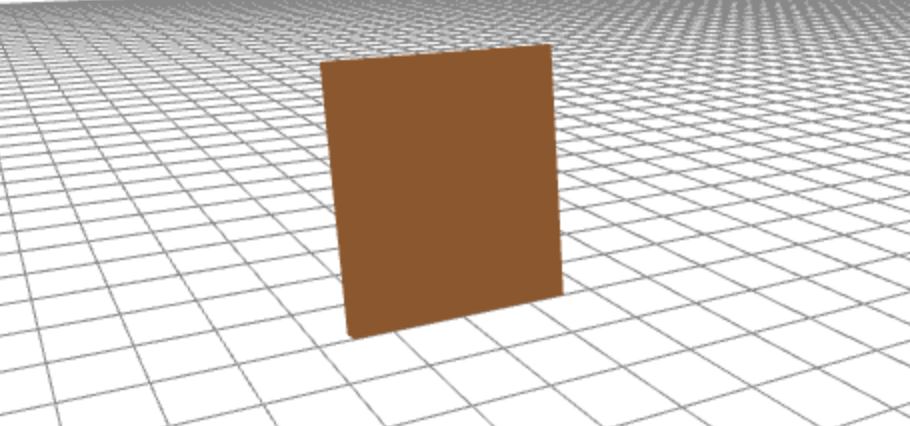

# Shape Studio

This week I launch the open bata for Shape Studio, a project I've been working on for the past few months. Shape Studio is an in-browser 3D modeling application built with React, rails, and Three.JS/React-Three-Fiber. This app is entirely built for the web which means no installing software, or buying expensive computer hardware needed to run it!

Shape Studio started as my final project for Flatiron School's Software Engineering Bootcamp, but quickly became much more than that. This is a project that I'm very passionate about and belive can really become something great. The build I've released is just a basic framework from which I hope to build a very useful tool in the realm of 3D modeling, but I'm very happy with it none the less.

## So What Can I Do With Shape Studio?

Good question!

The app is designed for 3D modeling or really any kind of 3D art, so you can sign up and build anything you put your mind to! Most things in the world are comprised of simple geometric shapes like a cube, sphere, cone, or cylindar. It's just a matter of manipulating those simple shapes into the forms that fit your needs.

The current build of Shape Studio allows the user to generate premade shapes into the 3D world and alter the position, scale, or rotation on the X,Y, or Z axis of that object.

### Basic Transform Controls

A user can alter the position of the object by selecting it and tapping the the 'Z' key which brings up the controls for chainging the position. Clicking and dragging on the transform controls will move the object according to the particular axis:

A user can alter the scale of an object as well by selecting it and tapping the 'X' key to bring up the scale controls. Again clicking and dragging on a particular axis control will scale the object on that axis:

And finally, A user can alter the rotation of an object by once again selecting it and tapping the 'C' key to bring up the rotation controls. And once again clicking and dragging on a particular axis control will rotate the object on that axis.

### Building Something

Now that we have an idea of how to transform our shapes into pieces that better fit our needs, we can build anything we want! For example, let's say you want to build a simple chair. Okay let's think about what shapes compose a chair?

We have the seat which let's say is a thin rectangular prism:

The back which is also a rectangular prism which is perpendicular to the seat:

And 4 legs, which can also be represented by long narrow rectangular prisms:

Put all the pieces together and we get:

All of this built from individual cubes that were moved, scaled, and rotated in space to the necessary location, size, and orientation respectively.

As you can imagine, you can get away with this simple building method for a lot of different types of objects, but I'd still love to implement more in-depth shape creation in the future!

And with that I'll talk about where we go from here with this project.

## What Comes Next?

There are a ton of awesome features I'd like to add to Shape Studio in the coming months, such as:

- Better system functions like copy/paste, or undo/redo
- Asset management
  - Allow users to upload their own skins or textures to be used on the 3D objects the're building
  - Also allow users to import/export their objects/builds as common 3D file types
- The ability to group objects together instead of having them act as individual objects
  - This would allow user to build a chair like the one above and move/scale/rotate the entire chair at once rather then each piece individually!
- More in-depth shape creation
  - Three.JS includes functionality for very intricate shapes. I'd love to build this into Shape Studio!
- An in-app 'object store' where user's can upload objects that they've created for use in other peoples projects!
  - Imagine you're building a scene that includes a kitchen set but you don't have the time to put it together yourself, you're in luck, you'd be able to search kitchen and find plenty of 3D models to include in your scene!

This project holds a special place in my heart and I look forward to building it out for as long as I can.

If you'd like to come along for the journey, sign up [here](https://shape.studio) and Start Creating!
